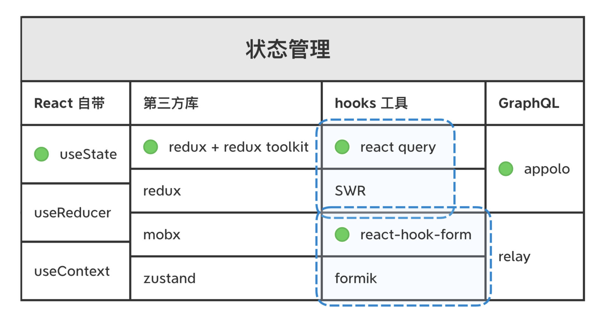

# RN 生态

1. React Native 生态是一个非常庞大的概念

很多知识是用到的时候才需要去深入学习的，在此之前你只需要知道这些知识大概是干什么用的就可以了。真正用到的时候，一边实践一边学习的效果会更好。

## 语言和框架

### 入门

### 状态管理

1. 常用的方案有 Redux + Redux Toolkit、单独的 Redux、Mobx 和 Zustand，在我以前做的《大家开发 RN 都用什么？》调研报告中，我发现大家用的最多的还是 Redux，但是 Redux 单独使用起来成本高，因此我建议你配合 Redux Toolkit 一起使用；

2. **hooks 工具：**hook 是一种抽象和复用组件状态逻辑的机制，因此 hooks 类工具很多，常用的、能帮我们管理部分状态 hooks 工具主要是这几类。react query 和 SWR 可以帮我们管理请求，react-hook-form 和 formik 可以帮忙管理表单；

3. **GraphQL：**现在后端接口大多是采用 (类) RESTful 架构，我们用的 GET、POST 请求就是这种架构。相对于 RESTful 架构，GraphQL 提供了一种更加灵活的请求后端接口的方案。GraphQL 是一种架构模式、是一种规范，业内有两种具体的实现，一种是开源社区常用的 Appolo 方案，另一种是 Meta 团队开源的 Relay 方案。

4. 示意图

### 自动化测试

1. 国内业务类的测试主要还是以 QA 测试为主，但一些由技术主导的通用组件和通用工具，有时候不一定有 QA 资源帮忙测试，这时候自动化测试就能派上用场了。我这里也给出了一些推荐：

- < 单元测试 - 中文 >Jest：这是 Meta 团队开发的一款 JavaScript 单元测试框架，单元测试中的单元指的是最小可测试粒度的函数单元。
- < 组件测试 - 英文 >react-native-testing-library：这是专门用来测试 React Native 组件的。比如，它提供了 render 方法可以专门测试组件渲染是否正确，fireEvent 方法可以专门用来测试事件返回值是否正确；
- Detox：它可以帮你在真机 / 模拟器运行测试代码，更符合真实环境。

### 样式和组件

1. 样式分为两类，一类是写样式的工具函数，另一类是自带风格样式的组件库

2. 样式工具可以分为三小类：

- React Native 自带了 “CSS In JS” 的 StyleSheet 接口；
- StyledComponent 这种方案，如果你喜欢纯正的 CSS 语法，可以选用这种；
- CSS 的“简拼”方案 Tailwind，它和 CSS 的区别类似我们打字时全拼和简拼区别，能让你敲击键盘的次数更少一些，但你需要记住它的“简拼”规则，而且还有一定的性能损耗。

3. **在 React Native 中推荐使用 StyleSheet 方案**

#### 组件库

1. toC 应用基本是不用组件库的。但移动应用也有很多 toB 应用，这些应用使用组件库开发，能够解决很大一部分的开发成本。

2. 最推荐的是近两年最活跃的组件库 Native Base，你也可以根据你们团队的喜好选择其他风格的组件库，其他常用的还有 React Native Elements、React Native Paper、UI Kitten。

## 组件

1. 组件包括核心组件和一些我们国内常用的组件。

2. 路由

社区提供了一些解决方案，包括 React Navigation、React Native Navigation 这两种。这两个库的名字很相似，也都是路由库，但你千万不要搞错了。目前业内主流的选择是 React Navigation，而不是 React Native Navigation，前者的下载量是后者的 20 倍之多，因此**推荐你直接使用 React Navigation 方案就可以了。**

3. 手势

React Native 本身提供了手势事件 PanResponder。PanResponder 是模仿 Web 的手势事件开发的，是命令式的手势事件，它的替代方式是社区开发的 react-native-gesture-handler。react-native-gesture-handler 是声明式的组件，会更符合我们的开发习惯。

4. 动画

动画常用的方案有这三种：

- 第一种是 React Native 本身提供的 Animated API；
- 第二种是社区提供的 Reanimated 组件；
- 第三种是直接接入设计师使用的 AE 输出的 Lottie 动画。

如何选择？

可以根据具体的业务情况来选择：如果是轻量级的动画，你不想多集成一个库，那你可以直接使用 Animated；**如果你对性能要求高又要大规模使用， 那 Reanimated 是你最好的选择；**最后 Lottie 的方案，适合那种没有人机交互的、由 UI 直接提供动画配置文件的动画形式。

### 国内常用的组件

1. 国内客户端生态和国外生态差别很大，很多国外的东西我们不能直接拿来用，而且国内社区的同学也封装了一些我们自己的解决方案。

2. < 流媒体 - 中英 >[react-native-agora](https://github.com/AgoraIO-Community/react-native-agora/blob/master/README.zh.md)：国内做语音、视频、直播很多用的都是声网的解决方案，该组件是由声网官方维护的 React Native 组件库；

3. [hms-react-native-plugin](https://github.com/HMS-Core/hms-react-native-plugin)：华为 HarmonyOS 系统为 React Native 开发的插件，由华为 HarmonyOS 官方开发维护；

4. < 推送 - 中文 >[jpush-react-native](https://github.com/jpush/jpush-react-native)：JPush 也就是极光推送，是国内客户端的推送解决方案了；

5. < 地图 - 中文 >react-native-baidu-map：是社区基于百度地图 Native SDK 封装的 React Native 组件，不过这个已经很久没有更新了，需要自己动手改改才能用

## 要点

1. 知识的输入决定了技术的输出。

2. 有一次我就问刘毅老师我说，“您在技术上这么厉害，最关键的原因是什么呢？”刘毅老师告诉我，是英语。他和我解释说最厉害那批程序员大多数都是用英语交流的，他经常去看这些论坛、博客，这样能接触到最前沿知识。

3. @reduxjs/toolkit 这个状态管理工具已经出来两年了，而且迭代速度很快，但是并没有中文官网。

4. 在学习 React Native 生态时，我强烈建议你不要对“中文”、“英文”资料有语言偏好，只看中文资料，不看英文资料。我建议你要对“权威的”、“二手的”资料有偏好，并不是说“二手”资料没有价值，而是“权威”资料可以帮你建立一个正确的基准。有了这个基准后，你就有了分辨对错、分辨好坏的能力，再去读“二手”资料就能知道别人讲得好不好、对你有没有价值了，没有这个基准就容易被带偏。

5. 遇到英文材料也不要害怕，你也借助翻译软件 DeepL，边学技术边提升英语能力。相信我，这样你的技术能力会突破得更快。
