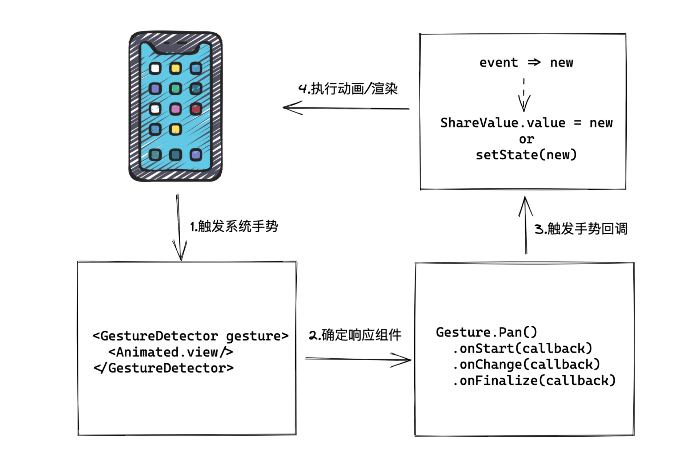

# Gesture

## 手势基础

1. Pressable 点按手势就是最基础的手势。

2. 响应 Pressable 手势要经过如下过程：

整个点按事件的响应过程是硬件和软件相互配合的过程。 Pressable 组件响应的整体流程，是从触摸屏识别物理手势开始，到系统和框架 Native 部分把物理手势转换为 JavaScript 手势事件，再到框架 JavaScript 部分确定响应手势的组件，最后到 Pressable 组件确定是点击还是长按。

**框架的 JavaScript 部分指的就是 React Native 自带的 PanResponder 手势系统，它是运行在 JavaScript 线程的。**

3. 手势库 Gesture，虽然在声明的初始化过程是运行在 JavaScript 线程中的，但声明之后的手势回调函数的执行都是默认运行在 UI 线程的，并且它和 Reanimated 可以很好地结合起来，一起使用。因此手势动效的全过程都是可以运行在 UI 线程的，不受 JavaScript 线程性能瓶颈的约束。

4. Gesture 手势库实现人机交互的原理图如下：



Gesture 手势库进行人机交互的基础流程一共分为 4 步：

- Gesture 手势库收到系统手势事件；
- Gesture 手势库确定需要响应哪些组件；
- Gesture 手势库触发相关手势回调函数；
- 通过 Gesture 回调函数返回 event 参数，使用回调返回值 event 可以更新共享值或状态，执行动画或渲染。

### 轻按手势

1. 在 Gesture 手势库接收到系统的手势后，它需要判断页面中有没有哪个视图需要响应该手势，如果没有任何组视图需要响应该手势，那么什么都不会发生。

```tsx
import { GestureDetector } from 'react-native-gesture-handler';

<GestureDetector gesture={singleTap}>
  <View />
</GestureDetector>;
```

- GestureDetector 组件是从 react-native-gesture-handler 库中导出的复合组件。

6. GestureDetector 复合组件不会真正渲染到屏幕上，它的作用是将配置好的手势绑定宿主组件视图上。

7. Gesture 对象是 react-native-gesture-handler 手势库提供的对象，在 Gesture 对象下，有一个 Tap 方法，调用该方法就可以生成一个轻按手势 singleTap。

8. **可以在 UI 线程中打印 console 日志，但是并不能在 UI 线程调用 setState 的渲染方法，如果调用就会报错**

渲染过程是跑在 JavaScript 线程中的，而 UI 线程的 JavaScript 虚拟机和 JavaScript 线程的 JavaScript 虚拟机的上下文是隔离的，UI 线程拿不到渲染相关的上下文。

9. setState 相关函数放到 UI 线程执行会报错，那我们就放回 JavaScript 线程执行呗？

```ts
import { runOnJS } from 'react-native-reanimated';

const [logs, setLogs] = useState<string[]>([]);
const singleTap = Gesture.Tap().onStart(() =>
  runOnJS(setLogs)(logs.concat('开始触发轻按事件'))
);
```

10. 在学习 Gesture 手势库的时候，你需要注意区分 UI 线程和 JavaScript 线程。Gesture 手势库和 Reanimated 动画库搭配使用时，Gesture 的手势回调函数是在 Reanimated 动画库创建的 UI 线程的 JavaScript 虚拟机中执行的。

## 实现一个拖拽动效

1. Gesture 手势库真正厉害的地方，在于能和 Reanimated 动画库配合着一起使用，它们二者一结合，就能玩出 React Native 老版本玩不出来的手势动画效果。

2. 通过 Gesture 手势库进行人机交互一共分为 4 步，除了第 1 步只需 Gesture 手势库底层参与外，其他 3 步都涉及代码

- 将拖拽手势绑定到动画组件上;

因为涉及动画，所以我们需要使用动画视图，也就是 Animated.View 视图。该 View 视图的样式属性，包括一个固定的圆形样式和一个动画样式 animatedStyles。

- 实现拖拽手势 dragGesture 和其手势回调;

轻按手势是 Gesture.Tap，拖拽手势 Gesture.Pan ，但 onStart、 onBegin、onChange 和 onFinalize 这 4 个手势回调之间有什么关系啊？为什么实现拖拽动效需要的是 onBegin、onChange 和 onFinalize 这三个手势回调呢？除了这 4 个手势回调，还有什么其他手势回调吗？

- 更新动画的共享值；

3. 拖拽手势相关的回调一共 10 个.

这些手势回调是按顺序从上到下依次触发的：

```tsx
const dragGesture = Gesture.Pan()
  .onBegin(() => console.log('onBegin'))
  .onTouchesDown(() => console.log('onTouchesDown'))
  .onTouchesMove(() => console.log('onTouchesMove'))
  .onStart(() => console.log('onStart'))
  .onUpdate(() => console.log('onUpdate'))
  .onChange(() => console.log('onChange'))
  .onTouchesUp(() => console.log('onTouchesUp'))
  .onEnd(() => console.log('onEnd'))
  .onTouchesCancelled(() => console.log('onTouchesCancelled'))
  .onFinalize(() => console.log('onFinalize'));
```

- onBegin：开始识别到手势，但此时拖拽并未发生。也就是说，这时你的手指是触碰到 View 视图，不过手指并未移动；
- onTouchesDown：手指按下触摸到视图时会触发。你可以理解为在手指触摸到视图时，先触发了 onBegin ，紧接着就触发了 onTouchesDown；
- onTouchesMove：手指移动后会触发；
- onStart：当手指移动距离超过 Float.MIN_VALUE 的阈值时，也就是精度为 0.000000 的距离时，就会触发该回调，此时拖拽事件正式触发；
- onUpdate：在手指移动的过程中 x/y 坐标系等参数会更新，参数更新后 onUpdate 回调就会触发；
- onChange：在手指移动的过程中 x/y 坐标系等参数会更新，参数更新后 onChange 回调会紧接着 onUpdate 触发。onChange 和 onUpdate 的区别是，onChange 的参数是以上一次回调的参数作为基准进行更新的，而 onUpdate 是以手势触发 onStart 时的参数为基准进行更新的；
- onTouchesUp：当手指离开屏幕时，触发 onTouchesUp 回调；
- onEnd：当手指离开屏幕时，会先触发 onTouchesUp 回调，然后紧接着触发 onEnd 回调。需要注意的是， onEnd 回调是和 onStart 配套出现的，如果没有触发 onStart 回调，那也不会触发 onEnd 回调；
- onTouchesCancelled：一般是在系统弹窗中断手势的情况下触发，较为少见；
- onFinalize：只要手势结束，最终都会触发 onFinalize 回调。

tips:

- 手指触碰和离开视图时是不会触发 onStart 和 onEnd 回调的，只会触发 onBegin 和 onFinalize 回调，因此我选择了 onBegin 和 onFinalize 来处理手指触碰和手指离开这两个事件。
- onUpdate 返回的是以 onStart 触发位置为基准的参数，而 onChange 返回的参数不仅包括 onUpdate 参数，还多了以上一次 onChange 触发位置为基准的偏移量 changeX 和 changeY.
