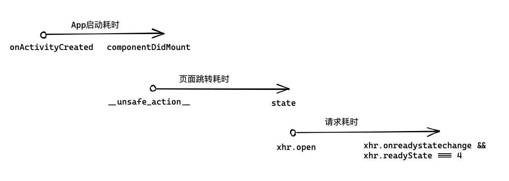

# 监控： sentry

Q: APP 上线后，遇到线上异常或线上性能问题如何处理？

1. 由于线上环境的复杂性，也难免遇到各种奇奇怪怪的线上 Bug。我们既然不能完全避免线上 Bug，那么就需要尽可能地减少线上 Bug 对用户的影响，这就要用到线上监控系统了。

2. 从头搭建和迭代一个监控系统的成本非常高。如果你有线上错误和性能的监控需求，但公司内部没有现成的监控系统，那我的建议是直接用 Sentry。

## sentry

1. [Sentry 官方文档](https://docs.sentry.io/)

2. [Sentry 的接入文档](https://docs.sentry.io/platforms/react-native/)

3. Sentry 线上监控 SDK 的底层原理，你会发现它主要收集了三类线上数据：

- 用户是谁；
- 用户报错；
- 用户性能；

4. 信息的收集必须遵守网信办的 [《网络数据安全管理条例（征求意见稿）》](http://www.cac.gov.cn/2021-11/14/c_1638501991577898.htm)，像设备唯一标示 IMEI、用户地理位置、运营商编号这些信息，我们是不能收集的。

5. 不能收集设备唯一标示 IMEI，那我们怎么知道用户是谁啊？

替代 IMEI 方案就是 UUID。

UUID 的全称是 Universally Unique Identifier，翻译过来就是通用唯一识别码，它是通过一个随机算法生成的 128 位的标识。生成两个重复 UUID 概率接近零，可以忽略不计，因此我们可以使用 UUID 代替与用户设备绑定的 IMEI 作为唯一标示符，该方法也是业内的通用方案之一。

### 实现一个简易监控 SDK

1. 可以使用 UUID 算法配合 AsyncStorage 或 MMKV 生成一个用户 ID：

```tsx
import uuid from 'react-native-uuid';
import { MMKV } from 'react-native-mmkv';

// 用户唯一标示
let userId = '';

const storage = new MMKV();
const hasUserId = storage.contains('userId');

// 用户曾经打开过 App
if (hasUserId) {
  userId = storage.get('userId');
} else {
  // 用户第一次打开 App
  userId = uuid.v4(); // ⇨ '9b1deb4d-3b7d-4bad-9bdd-2b0d7b3dcb6d'
  storage.set('userId', userId);
}
```

- react-native-uuid 是 UUID 算法的 React Native 版本;
- react-native-mmkv 是持久化键值存储工具，MMKV 的性能比 AsyncStorage 更好，所以这里就用它代替了 AsyncStorage。

有了 userId 这个用户唯一标示后，后台分析收集上来的线上信息时，就可以把线上报错、性能等信息和某个具体的用户挂上钩了，比如你可以通过对 userId 字段进行去重，来确定它影响了多少用户。

2. 有 userId，用户画像还是不够清晰，还得知道他设备信息，这样用户画像才更立体。在 React Native 中，你可以通过 react-native-device-info 来获取设备信息

示例代码如下：

```tsx
import DeviceInfo from 'react-native-device-info';

// API 提供了获取的能力，但根据 《网络数据安全管理条例（征求意见稿）》 是不能上报的，所以推荐使用 uuid 代替。

const androidIdPromise = DeviceInfo.getAndroidId();

// 将设备信息收集到一个 deviceInfo 对象中，统一上报。
const deviceInfo = {};
deviceInfo.systemName = DeviceInfo.getSystemName(); // iOS: "iOS" Android: "Android"
deviceInfo.systemVersion = DeviceInfo.getSystemVersion(); // iOS: "11.0" Android: "7.1.1"
deviceInfo.brand = getBrand(); // iOS: "Apple" Android: "xiaomi"
deviceInfo.appName = DeviceInfo.getApplicationName(); // AwesomeApp
deviceInfo.appVersion = DeviceInfo.getVersion(); // iOS: "1.0" Android: "1.0"
```

### JavaScript 报错的收集

1. 解决了“用户是谁”这个问题后，还需要处理“用户报了什么错？”

2. 监控 SDK 如何收集这些报错信息呢？

主要有三种方案：

- ErrorUtils.setGlobalHandler；
- PromiseRejectionTracking；
- Error Boundaries。

3. ErrorUtils.setGlobalHandler，它是用来处理 JavaScript 的全局异常的。

示例代码：

```ts

function throwError(errorName){
    thow new Error(errorName)
}

// 1.被捕获的错误
try {
    throwError('该错误会被 try catch 捕获')
} catch(){}

// 2.未被捕获的错误
throwError('该错误没有捕获，会抛到全局')
```

Q: React Native 框架在本地调试时使用的是 ErrorUtils.setGlobalHandler，那么是否可以把这段逻辑改改用于线上错误监控呢？

两个方案：

- 一种是使用 patch-package 修改 React Native 源码；
- 使用 ErrorUtils.setGlobalHandler 重写回调函数。

重写回调函数比直接修改源码侵入性更小，更利于后续维护，因此我选择了重写回调函数的方式：

```ts
const defaultHandler =
  ErrorUtils.getGlobalHandler && ErrorUtils.getGlobalHandler();

ErrorUtils.setGlobalHandler((error: Error, isFatal?: boolean) => {
  console.log(
    `Global Error Handled: ${JSON.stringify(
      {
        isFatal,
        errorName: error.name,
        errorMessage: error.message,
        componentStack: error.componentStack,
        errorStack: error.stack,
      },
      null,
      2
    )}`
  );

  defaultHandler(error, isFatal);
});
```

5. 本地调试时，如果一个报错抛到了全局作用域，就会出现红屏。

本地调试的红屏其实是，React Native 框架在内部使用 ErrorUtils.setGlobalHandler 捕获到全局错误后，调用 LogBox 显示的红屏。红屏报错逻辑涉及框架源码的两个文件，分别是 setUpErrorHandling.js 和 ExceptionsManager.js

6. Promise 报错的收集

**普通 JavaScript 错误，可以使用 try catch 捕获，但 promise 错误， try catch 是捕获不到的，需要用 promise.catch 来捕获。因此，二者全局的捕获机制也不一样。**

React Native 提供了两种 Promise 捕获机制，一种是由新架构的 Hermes 引擎提供的捕获机制，另一种是老架构非 Hermes 引擎提供的捕获机制。这两种捕获机制，你都可以在 React Native 源码中找到，它涉及 polyfillPromise.js、Promise.js 、promiseRejectionTrackingOptions.js 三个文件

Q: 如何将未被捕获的 Promise 错误上报呢？

答案就是再调用上一次 Hermes 引擎提供的 enablePromiseRejectionTracker 方法，或者再调用一次 rejection-tracking 文件暴露的 enable 方法，将框架的默认处理逻辑覆盖。

```ts

const cusotomtRejectionTrackingOptions = {
  allRejections: true,
  onUnhandled: (id: string, error: Error) => {
    console.log(
      `Possible Unhandled Promise Rejection: ${JSON.stringify({
        id,
        errorMessage: error.message,
        errorStack: error.stack,
      },null,2)}`,
  },
  onHandled : (id: string) => {}
}

if (global?.HermesInternal?.hasPromise?.()) {
  if (__DEV__) {
    global.HermesInternal?.enablePromiseRejectionTracker?.(
      cusotomtRejectionTrackingOptions,
    );
  }
} else {
  if (__DEV__) {
    require('promise/setimmediate/rejection-tracking').enable(
      cusotomtRejectionTrackingOptions,
    );
  }
}
```

7. **组件 render 报错的收集**

在 React/React Native 应用中，除了全局 JavaScript 报错和未捕获的 Promise 报错以外，还有一类报错可以统一处理，就是 React/React Native 的 render 报错。

在类组件中，render 报错指的是类的 render 方法执行报错，在函数组件中，render 报错指的是函数本身执行报错了。

Q: 如何解决整个页面无响应或者白屏的问题呢？

React/React Native 也提供了类似 try catch 的方法，叫做 Error Boundaries。Error Boundaries 是专门用于捕获组件 render 错误的。

React/React Native 只提供了类组件捕获 render 错误的方法，如果是函数组件，必须将其嵌套在类组件中才能捕获其 render 错误。业内通常的做法是将其封装成一个通用方法给其他组件使用。

简易的 ErrorBoundary 组件的示例代码：

```ts
class ErrorBoundary extends React.Component {
  constructor(props) {
    super(props);
    this.state = { hasError: false };
  }

  static getDerivedStateFromError(error) {
    // 更新 state 使下一次渲染能够显示降级后的 UI
    return { hasError: true };
  }

  componentDidCatch(error, errorInfo) {
    // 你同样可以将错误日志上报给服务器
    logErrorToMyService(error, errorInfo);
  }

  render() {
    if (this.state.hasError) {
      // 你可以自定义降级后的 UI 并渲染
      return <View>404页面</View>;
    }

    return this.props.children;
  }
}

// 使用方法
<ErrorBoundary>
  <App />
</ErrorBoundary>;
```

## 基本信息收集

1. 先明确一点，解决线上问题和本地问题的思路是不一样的。

2. 在解决本地问题时，你不仅可以不断修改代码，反复尝试寻找解决方案，你还可以使用调试工具，比如 Flipper，它有打日志、打断点、查看性能火焰图等功能。然而在解决线上问题时，我们并不能反复尝试和使用调试工具。

3. 能借助的只有类似 Sentry 这样的线上监控工具。这些线上监控工具帮你记录了用户是谁，用户又是在什么情况下，出现了什么问题。你有了这些线上信息之后，才能确定问题的影响范围和紧急程度，也能更方便修复线上问题。

## 性能收集

1. 相对于错误收集，性能收集的优先级会低一些，因为错误影响的是能不能操作的问题，性能影响的是操作快点或慢点的体验问题。

2. sentry 主要收集的性能包括：

- App 启动耗时；
- 页面跳转耗时；
- 请求耗时；

3. 耗时类统计的关键是找准开始时间点和结束时间点。对于 App 启动耗时、页面跳转耗时和请求耗时的时间点：



虽然 App 只有一个，但页面、请求有很多个。统计 App 启动耗时可以在 Native 根组件或 React 根组件的生命周期里面统计，只需统计一次就行。

4. 如何统计 App 中所有的页面跳转和请求耗时呢？

如果你使用的是 React Navigation，那在每次页面跳转之前都需要下达跳转命令。在下达跳转命令的时候会触发 **unsafe_action** 事件，你可以在 **unsafe_action** 事件的回调中添加页面跳转耗时的开始时间点。在页面跳转完成后，页面的状态会发生改变，此时会触发 state 改变事件，此时添加结束时间点。

示例代码：

```tsx
function App({ navigation }) {
  useEffect(() => {
    let startTime = 0;

    navigation.addListener('__unsafe_action__', (e) => {
      startTime = Date.now();
    });

    navigation.addListener('state', (e) => {
      const totalTime = Date.now() - startTime;
      console.log(`totalTime:${totalTime}`);
    });
  }, []);

  return <></>;
}
```

无须在每个组件的声明周期里面都添加回调，只用在 App 根组件挂载后，直接监听导航命令触发的 **unsafe_action** 和 state 事件就可以完成页面跳转耗时的统计。

### 请求耗时

1. 示例代码：

```tsx
let startTime = 0;

const originalOpen = XMLHttpRequest.prototype.open;

XMLHttpRequest.prototype.open(function (...args) {
  startTime = Date.now();
  const xhr = this;

  const originalOnready = xhr.prototype.onreadystatechange;

  xhr.prototype.onreadystatechange = function (...readyStateArgs) {
    if (xhr.readyState === 4) {
      const totalTime = Date.now() - startTime;
      console.log(`totalTime:${totalTime}`);
    }
    originalOnready(...readyStateArgs);
  };

  originalOpen.apply(xhr, args);
});
```

2. React Native 中的 fetch 或 axios 请求都是基于 XMLHttpRequest 包装的，所以要统计请求耗时，就要监听 XMLHttpRequest 的 open 事件，以及其实例 xhr 的 onreadystatechange 事件。在 open 事件中，记录请求开始的时间点，在 onreadystatechange 事件触发时且 xhr.readyState 等于 4 时记录请求的结束时间点。这里 xhr.readyState 等于 4 就代表下载操作已完成。

3. **如果你想实现一些稍微底层的库，比如线上监控，你就必须深入底层，把这些底层的 API 搞懂才行。**

4. 服务端接收到这些从用户手机发来的错误和性能数据后，它会将这些数据进行处理、存储和展示，这就是线上监控的基本原理。
