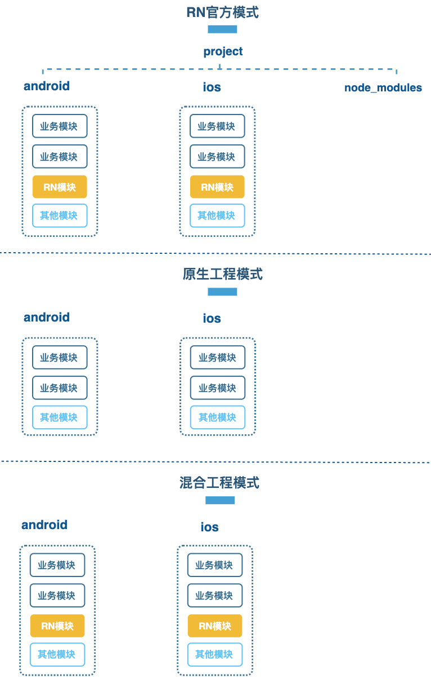
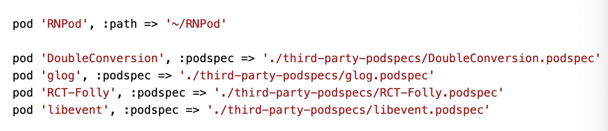
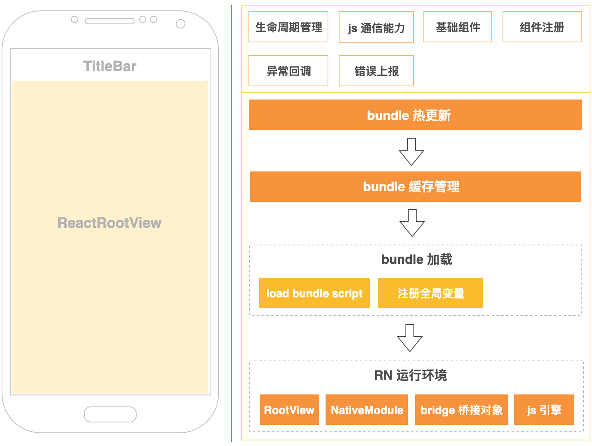
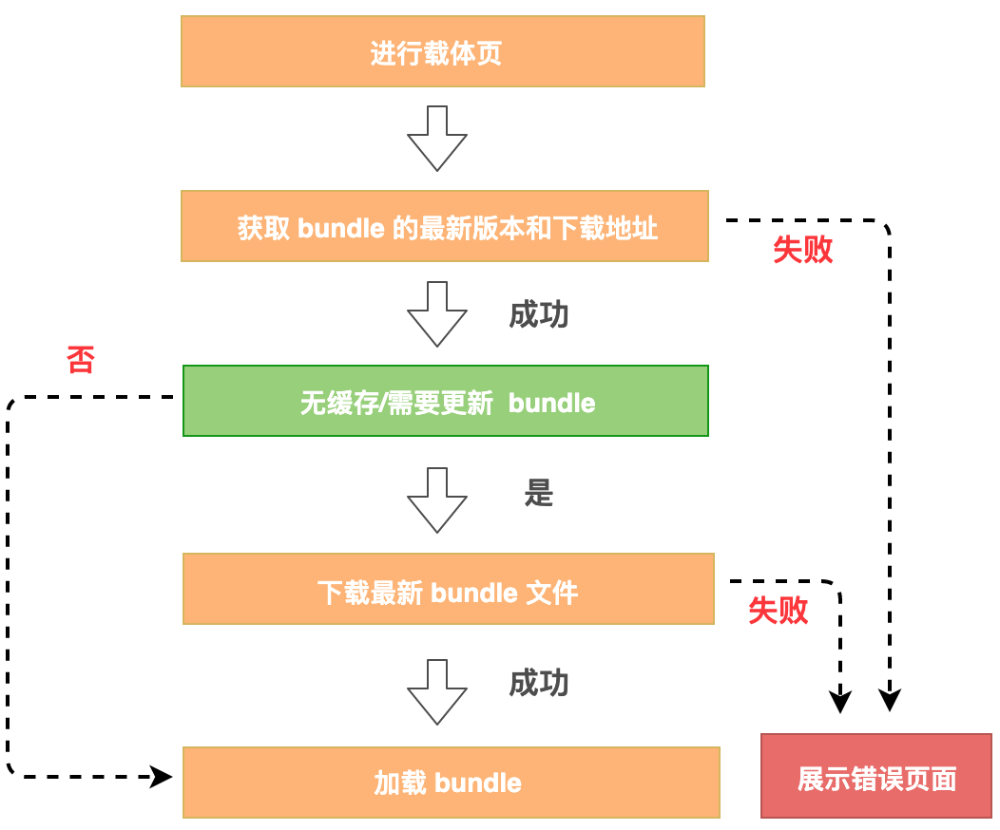

# 混合应用：从零开始集成 React Native

## App 混合开发指的是什么？

1. app 混合开发，指的是一个 APP 部分功能用 native 构建，部分功能用跨端框架构建。

2. 目前比较流行的跨端框架有 H5、React Native、Flutter、布局动态化等。

3. 以 Native 与 React Native 混合开发为例，在同一个 App 中，通常存在以下几种形态：

- 原生页面；
- RN 页面；
- 原生混嵌 RN;
- RN 混嵌原生。

4. Native 与 React Native 混合开发一般会用在哪儿呢？

一些大型 App 中，比如美团、携程、京东、58 等。这些大型 App 一般都非常复杂，整个框架需要包含模块化、组件化、插件化、跨端等能力。相比纯 React Native 工程，大型 App 的实际业务开发还需要考虑如何在已有原生项目中引入 React Native，作为原生框架的扩展能力。比如，部分业务可能对开发效率、多端一致性、动态更新能力有较强要求，就可以使用 React Native 来实现。

5. 原生改造成 React Native 并不是那么简单的事情，毕竟开发语言、页面管理、模块管理完全是另一套东西，而且一些原生页面，如启动页、首页等，出于性能考虑，大都还是会选择原生来实现。

6. 混合开发的优点：

- 开发效率高，一套代码可以在 Android、iOS 上运行；
- 更新部署方便，无须依赖应用市场发版，迭代更新速度快；
- 具备动态更新能力，特别是国内 App，以 Android 为例，受限于 Google Play，无法使用 Android App bundle，而插件化框架又存在稳定性问题。而业务快速迭代、Bug 响应速度都对动态更新能力有强烈的需求。

7. 混合开发也不是万能的，它也有一些缺点，要特别注意：

- **性能不佳。**H5 渲染链路长；React Native 依托于 JS bridge 交互 （指旧版，最新架构使用 JSI）；虽然 Flutter 绘制流程直接使用 Skia，但依赖于原生的能力仍需异步交互；
- **兼容性差。**Android、iOS 各版本都存在各种兼容性问题，特别是 Android 碎片化严重；
- **问题排查成本高。**跨端框架一般涉及 Native、FE、Server，中间做了大量的桥接转换，排查链路比纯 Native 长；
- **动态化能力受限**。相比纯原生的插件化，跨端框架动态更新的业务如果涉及 Native 部分的组件更新，需要依赖 App 发版。

8. 现在一般大型 App 都是多套跨端框架并存的，比如 H5 + React Native + 布局动态化，或 H5 + Flutter，具体选型主要以业务场景、包大小、性能、运行内存、动态更新能力为标准进行。

9. 在 React Native 的混合开发中，需要关注下面这几个主要问题和流程：

- 如何从 0 ～ 1 进行环境配置；
- 通用的 React Native 载体页如何设计，需要包含哪些能力；
- 如何调试打包发布；
- 遇到混合开发的 bug 如何进行排查与修复。

## 环境搭建

### Android

1. 第一步：创建本地工程

使用 Android Studio 创建一个新的 App 项目，如果你已经有了本地项目，可以跳过此步骤。填写完项目名称、包名、项目本地路径后，点击 “Finish” 按钮。

2. 第二步：添加依赖

> [文档](https://www.react-native.cn/docs/integration-with-existing-apps/)

两种方式：

- “创建一个空目录用于存放 React Native 项目，然后在其中创建一个 /android 子目录，把你现有的 Android 项目拷贝到 /android 子目录中”，它更偏向于 React Native 的工程管理模式。

- 在实际开发中，特别是已经上线的项目里面，React Native 功能和其他业务功能一样，一般会被当成原生工程的子模块来管理，所以我们这边选择**偏向混合工程管理方式**来集成。

几种模式示意图：



采用混合工程模式，是基于以下几点考虑的：

- 可以不侵入现有工程结构，React Native 模块会作为现有工程的一部分进行组织管理。
- 不会影响代码仓库管理，不用把 Android、iOS 放在同一代码仓库下进行管理。
- 混合模式方便我们进行组件功能复用，你可以将 React Native 模块独立成组件，提供给其他 App 平台使用。

基于混合工程模式集成 React Native 模块需要哪些依赖项呢？

主要是：

- react-native：React Native 的核心框架；
- JavaScript 引擎：可选 JSC、Hermes，用于执行 JavaScript。接下来，我们参考文档进行如下操作：

```sh
yarn add react-native@0.68.0-rc3
```

执行以上命令成功之后，我们会发现 项目工程下多了一个 node_modules 目录，里面不仅有 react-native 框架，还有 JavaScript 引擎编译好的产物，包括 aar 和 pom 依赖文件。接下来，我们可以参考官方提供的方式，将 node_modules 目录配置为 repository，然后在工程中引入相关依赖。

不过，这种方式并不太推荐，其实我们只需要 react-native 和 JavaScript 引擎这两个产物就可以了。获取这两个产物后，在 Android 自己进行二次封装，然后发布到公司的远程仓库，就不用忍受一大堆无用的文件存放在项目中了

目前 node_modules 目录里有这几个内容：

- /node_modules/react-native（本地安装好的 node_module 中的 react-native 框架编译产物）；
- /node_modules/JavaScriptc-android（本地安装好的 node_module 中的 JSC 引擎编译产物）；
- /node_modules/hermes-engine（本地安装好的 node_module 中的 Hermes 引擎编译产物）；

其中只有 react-native 框架是必需的，而具体选择 JSC 引擎还是 Hermes 引擎，你可以参考以下几个点：

- 在启动性能上，Hermes 比 JSC 更快。Hermes 采用的是 AOT 提前编译的方案，它支持字节码文件，相比于 JSC，Hermes 不用先将 JavaScript 文本编译为字节码，节约了编译字节码的耗时，自然启动性能更好。
- 在运行性能上，JSC 比 Herems 更快。JSC 使用的是 JIT 即时编译方案，该方案支持动态缓存热点代码，因此运行性能上更快。

整体而言，由于 Hermes 引擎是专门为移动端定制的，在引擎大小、启动速度、运行内存、通信性能等方面都优于 JSC。**如果你的是新项目，没有历史负担，建议你直接使用 Hermes 引擎。**如果是之前已使用 JSC 引擎上线的项目，可以往 Hermes 引擎进行升级。

3. 工程添加 react native 相关的依赖，包括：

- react-native.arr 文件；
- react-native.aar 依赖的第三方库；
- JavaScript 引擎 aar 文件。

先来添加 react-native.arr 文件。我们将 …/[项目名称]/node_modules/react-native/ 目录下的 react-native-0.68.0-rc.3.aar 拷贝放置到 [项目名称]/libs 目录。注意，Android 引入本地 aar 文件需要在工程根目录 build.gradle 添加 flatDir 配置：

```build.gradle

allprojects {
    repositories {
        google()
        jcenter()
        // 添加 flatDir 配置
        flatDir {
            dirs 'libs'
        }
    }
}
```

在 [项目名称]/app 模块下的 build.gradle 添加依赖：

```build.gradle
implementation(name:'react-native-0.68.0-rc.3', ext:'aar')
```

再将 …/[项目名称]/node_modules/react-native/ 目录下的 react-native-0.68.0-rc.3.pom 中的依赖库，按照 android gradle 依赖的方式进行添加，这些依赖主要是 react-native aar 本身远程依赖的第三方库。添加好的 app build.gradle 如下：

```build.gradle

dependencies {
    implementation(name:'react-native-0.68.0-rc.3', ext:'aar')

    implementation 'com.facebook.infer.annotation:infer-annotation:0.18.0'
    implementation 'javax.inject:javax.inject:1'
    implementation 'androidx.appcompat:appcompat:1.0.2'
    implementation 'com.facebook.fresco:imagepipeline-okhttp3:2.5.0'
    implementation 'com.facebook.fresco:fresco:2.5.0'
    implementation 'com.facebook.soloader:soloader:0.10.3'
    implementation 'com.google.code.findbugs:jsr305:3.0.2'
    implementation 'com.squareup.okhttp3:okhttp:4.9.2'
    implementation 'com.squareup.okhttp3:okhttp-urlconnection:4.9.2'
    implementation 'com.squareup.okio:okio:2.9.0'
}
```

最后，我们添加下 JavaScript 引擎 aar 就可以了。这边我们使用 JSC 引擎 (Hermes 引擎则是将 …/[项目名称]/node_modules/hermes-engine 下的 hermes-cppruntime-release.aar & hermes-release.aar 拷贝到 libs 目录，并在 build.gradle 中添加依赖)。JSC aar 位于 …/[项目名称]/node_modules/jsc-android 目录下，主要是 jsc 的 so 动态库，将 android-jsc-r250230.aar 拷贝到 [项目名称]/libs 目录：

完整的 [项目名称]/app/build.gradle 依赖配置如下：

```build.gradle

dependencies {
    implementation(name:'react-native-0.68.0-rc.3', ext:'aar')
    implementation(name:'android-jsc-r250230', ext:'aar')

    implementation 'com.facebook.infer.annotation:infer-annotation:0.18.0'
    implementation 'javax.inject:javax.inject:1'
    implementation 'androidx.appcompat:appcompat:1.0.2'
    implementation 'com.facebook.fresco:imagepipeline-okhttp3:2.5.0'
    implementation 'com.facebook.fresco:fresco:2.5.0'
    implementation 'com.facebook.soloader:soloader:0.10.3'
    implementation 'com.google.code.findbugs:jsr305:3.0.2'
    implementation 'com.squareup.okhttp3:okhttp:4.9.2'
    implementation 'com.squareup.okhttp3:okhttp-urlconnection:4.9.2'
    implementation 'com.squareup.okio:okio:2.9.0'
}
```

React Native 相关的依赖配置已经完成，这时候你可以将 [项目名称]/node_modules 删除了。

3. **第三步：配置权限**

配置好相关的依赖库后，我们需要来添加下权限和清单配置。这个很简单，我们只需要在 [项目名称]/app 的 AndroidManifest.xml 清单文件中声明网络权限就好了：

```xml
<uses-permission android:name="android.permission.INTERNET"
/>

<!-- 访问开发者菜单界面 -->
<activity android:name="com.facebook.react.devsupport.DevSettingsActivity" />
```

## iOS

1. 第一步：创建本地工程

在本地创建一个对应版本的 React Native 工程。

创建好后，我们再打开工程，在工程 node_modules/react-native/template/ 目录下执行 npm install，然后进入 /ios/ 目录下执行 pod install，结束后再打开 react native workspace 工程。

这就是 iOS 中创建一个新的工程，接入 React Native 功能的方案。

**Q： 如何在已有的 iOS 工程中接入 React Native 呢？**

1.1. 首先，你需要将以下三个 React Native 源码引入到 iOS 工程中，这三个源码分别为 Libraries、React，以及 React Common。

1.2. 然后你将这三个部分作为 React Native 功能模块，直接参考官方提供的 podspec（三个不同模块的 podspec 请参考https://github.com/facebook/react-native），并结合自己工程，选择合理的接入方案，集成到 iOS 工程中就可以了

3. 第二步：添加 iOS 端依赖的库

修改 Podfile，来引用其他依赖的第三方库，包括 DoubleConverison、glog、RCT_Folly、libevent，等等。podspec 配置文件则直接使用官方提供的文件：



之后，我们再执行 pod install 并构建工程文件 xcworkspace，并打开工程文件，进行编译就可以了。

## 基础

1. Android 与 iOS 中 React Native 混合应用的工程组织结构是一样的。与 React Native 新项目不同，在已有 Android 和 iOS 项目中接入 React Native，都是把 React Native 当成子模块进行引入的。

环境配置流程中，Android 侧重于依赖 React Native 的框架 aar，以及 JavaScript 引擎 aar，而 iOS 则是使用源码方式集成 React Native 相关的依赖库。两方的核心都是依赖 React Native 框架、JavaScript 引擎，以及框架本身依赖的其他库。

### 载体页设计

1. 搭建好工程环境配置后，我们就要来设计一个 React Native 载体页了。载体页是加载渲染 React Native 的容器，在 Android 中为 Activity/Fragment，在 iOS 中为 ViewController。

2. 按照官方的[文档](https://www.react-native.cn/docs/integration-with-existing-apps)，一个简单的载体页只需要初始化、加载渲染、生命周期管理、组件注册能力即可。以 Android 为例，搭建一个 Activity，构建 ReactRootView，初始化 ReactInstanceManager 就可以加载本地的 bundle 文件了。你可以按照官方文档，快速搭建一个 React Native 载体页试试。

3. 在实际开发中，我们使用 React Native，除了看中它跨平台的优势外，还需要它的热更新能力。并且，为了进行 Bug 调试和分析，需要具备错误处理、上报能力，以及复杂业务中，Native & JavaScript 通信还需要提供通信能力。甚至，根据业务需求，还需要提供一些通用内置组件、组件注册能力，等等。

所以一个可用于商业上线的载体页，需要提供初始化、加载渲染 React Native 页面、热更新、缓存管理、生命周期管理、Native & JavaScript 通信、错误处理、错误上报、内置基础组件、组件注册等能力。

#### 载体页整体设计

1. 概述图：



2. 一个完整的载体页设计，应该包含下面几个部分：

- **UI 结构：**在混合开发中，React Native 大部分以独立页面存在，载体页可以包含通用标题栏和 React Native 容器。当然也可以直接暴露容器视图，由使用方动态进行添加；
- **对外能力：**包含生命周期管理、Native 与 JavaScript 通信能力、内置的基础业务组件、组件注册能力、异常回调、错误上报等，同时还需要提供热更新、加载 bundle 的能力；
- **热更新：**请求远程服务器获取对应 bundle 是否有最新版本。有最新版本则下载并进行缓存，无最新版本则使用缓存进行加载 (无缓存则先下载)，其中包含预加载、异步更新等业务策略提升加载性能。
- **缓存管理：**通常 bundle 包随着业务体量增加，体积会越来越大。针对这种情况，我们的常用策略是拆包、按需加载，bundle 包在传输过程中会进行 zip 压缩、加密，下载成功后进行解压、校验。每个 bundle 文件都有对应的 id、版本号、content hash；
- **bundle 加载：**JavaScript 引擎读取 bundle 文件，常用引擎包括 JSC、Hermes；
- **React Native 运行环境：**整个 React Native 运行环境包含负责渲染的 RootView，框架内置核心组件、业务定制组件，执行脚本的 JavaScript 引擎，负责 Native 与 JavaScript 交互的 bridge/JSI。

### 初始化载体页

1. 初始化，除了自身业务封装的初始化外，核心还是 React Native 框架本身的初始化。

#### Android

1. React Native Android 中几个常用类的作用：

- **ReactContext**：继承于 ContextWrapper，是 React Native 应用的上下文，管理着 CatalystInstance 以及三大线程 （UIThread、NativeModulesThread、JSThread）；
- **ReactInstanceManager**：总的管理类，管理 ReactPackage、ReactContext、ReactRootView、控制生命周期，同时还可以设置 JavaScript 引擎；
- **ReactRootView**：React Native 渲染的原生容器，继承于 FrameLayout；
- **CatalystInstance**：Java 层、C++ 层、JavaScript 层通信的总管理类，管理着 Java 层、JavaScript 层 Module 映射表与回调，是三端通信的桥梁。实现类为 CatalystInstanceImpl，支持向 JavaScript 注入全局变量、动态加载脚本文件、获取 NativeModules & JSModules；
- **JavaScriptModule**：JS Module，负责 JavaScript 到 Java 的映射调用格式声明，由 CatalystInstance 统一管理；
- **NativeModule**：Java Module，负责 Java 到 JavaScript 的映射调用格式声明，由 CatalystInstance 统一管理；
- **UIManager**: 处理 UI 的渲染，JavaScript 层通过 C++ 层把创建 View 的请求发送给 Java 层的 UIManagerModule。

2. 初始化的核心是通过 ReactInstanceManagerBuilder 构建 ReactInstanceManager，[官方](https://www.react-native.cn/docs/integration-with-existing-apps)提供了对 ReactInstanceManager 的构建说明。我们直接来看一段 Demo：

```java

ReactInstanceManagerBuilder builder = ReactInstanceManager.builder();
// 设置 application 上下文
builder.setApplication((Application) context.getApplicationContext());

// 添加包，一个 package 由多个组件构成，上述代码中的 MainReactPackage 是 RN 内置的 package
builder.addPackage(new MainReactPackage());

// JS 异常回调处理实现，在这个实现中我们可以打印 JS 异常日志，上报错误
builder.setRedBoxHandler(mRedBoxHandler);

// native module 异常回调处理实现，在这个实现中我们可以打印 native module 异常日志，上报错误
builder.setNativeModuleCallExceptionHandler(mNativeModuleExceptionHandler);

// JS bundle 中主入口的文件名，demo 中 "index" 表示入口文件名为 index.js
builder.setJSMainModulePath("index");

// 是否开启 dev 模式
builder.setUseDeveloperSupport(true);

// 设置创建时机
builder.setInitialLifecycleState(LifecycleState.BEFORE_CREATE);

// 设置 JS 引擎，如果想使用 Hermes 引擎，可以这样设置，需要引入 Hermes 相关的 so 库
// builder.setJavaScriptExecutorFactory(new HermesExecutorFactory());

ReactInstanceManager reactInstanceManager = builder.build();
```

获取 ReactContext，ReactContext 在后续加载渲染过程中会用到：

```java

reactInstanceManager.addReactInstanceEventListener(new ReactInstanceManager.ReactInstanceEventListener() {
    @Override
    public void onReactContextInitialized(ReactContext reactContext) {
       mReactContext = reactContext;
    }
});
```

Android 端的初始化工作就完成了，

#### ios

iOS 端初始化载体页比较简单，只需要下面几个步骤。

1. 首先，我们要创建一个 Bridge。在 React Native 中，通过 Bridge 实现了 JavaScript 与原生框架之间的通信，调用 React Native 提供的 API ，就相当于通过 Bridge 调用原生的 API。因此，我们需要创建一个 Bridge，与载体页一对一绑定。

```
 RCTBridge *carrierBridge = [[RCTBridge alloc] initWithDelegate:self
                                               launchOptions:nil];
```

2. 创建一个 RCTRootView，用于展示 React Native 视图的组件 RCTRootView，在 JavaScript 代码中 render() 部分的 UI 组件均会渲染到该 View 中，创建方式如下：

```
 RCTRootView *rctView = [[RCTRootView alloc] initWithBridge:bridge
                                             moduleName:moduleName
                                             initialProperties:nil];
 [self.view addSubview:rctView];
```

到此， iOS 端初始化准备过程就完成了。

3. 需要获取 React Native 代码包，也就是 JS Bundle 资源。那么要怎么动态下载 JS Bundle 资源呢？

可以采用热更新策略，动态下载 JS bundle 资源。每个不同的 JS bundle 包都有它自己的标识 id，我们可以根据该 id 从服务器中获取该 JS bundle 资源对应的最新版本号，以及最新资源下载地址。

在获取 JS Bundle 的最新版本号后，如果用户之前浏览过当前 React Native 页面，还存在缓存，那么我们就可以检测缓存版本号是否与最新版本号相同。如果是相同的，就不需要重复下载了；如果不相同，那你还要根据最新资源下载地址，下载最新的资源包，并缓存到本地。

要是用户之前并没有浏览过当前 React Native 页面，或者缓存已被清空，你可以直接根据最新资源下载地址，下载最新的资源包，并缓存到本地。

整体流程图：



### 加载渲染

1. 通过以上步骤，我们就能创建好载体页并成功下载 JS bundle 了，那么现在就可以准备开始执行 JavaScript 代码并渲染 React Native 页面了

#### 加载 JS bundle（Android）

1. Android 端通过 ReactContext 获取 CatalystInstance 对象，CatalystInstance 实现类为 CatalystInstanceImp。CatalystInstanceImpl 有一个非 public 方法 loadScriptFromFile()，我们通过这个方法就可以动态加载本地的 bundle 文件了。不过，由于 loadScriptFromFile() 为非 public，所以需要反射获取调用：

```java

CatalystInstance catalystInstance = mReactContext.getCatalystInstance();
Method loadScripFromFileMethod = CatalystInstanceImpl.class.getDeclaredMethod("loadScriptFromFile", String.class, String.class, boolean.class);
loadScripFromFileMethod.setAccessible(true);
// fileName 和 sourceURL 传入本地缓存的 bundle 路径，loadSynchronously 为是否同步加载
loadScripFromFileMethod.invoke(catalystInstance, fileName, sourceURL, loadSynchronously);
```

1. 接着，我们再调用 ReactRootView startReactApplication 就可以开始加载渲染 React Native 页面了。这里要注意，startReactApplication() 中的参数 moduleName 必须对应 “index.js” 中的 “AppRegistry.registerComponent()” 的第一个参数：

```java

reactRootView.startReactApplication(reactInstanceManager, moduleName, launchOption);
```

还可以使用 catalystInstance.setGlobalVariable() 设置全局变量。设置好后，JavaScript 运行时可获取到这些全局变量了：

```java
catalystInstance.setGlobalVariable("xxx", xxx)
```

Android 端动态加载 bundle 完成了。

#### 加载 JS bundle（iOS）

1. iOS 端可以在包下载完成后初始化 Bridge（注： Bridge 在源码中是 JS Bridge 或者 JSI 的统称）。Bridge 初始化后，我们就可以开始加载下载好的 JavaScript 包了。

2. 整体流程：

- 在初始化 Bridge 时，在 setup 的过程中，首先会调用 bridge 的代理方法 (NSURL _)sourceURLForBridge : (RCTBridge _)bridge 方法，指定获取 JS bundle 的路径：

```
 -(NSURL *)sourceURLForBridge:(RCTBridge *)bridge{
    NSString *bundlePath = [self getCurrentBundlePath:bundleid];
    return bundlePath;
}
```

- 确定 URL 之后，bridge 会调用 start 方法，开始加载 JS bundle 并调用以下方法：

```
 [self loadSource:^(NSError *error, RCTSource *source) {
    if (error) {
      [weakSelf handleError:error];
    }
    ...
 ]
```

- 调用 bridge 的代理方法，我们可以在该方法中手动注入一些业务参数：

```

- (void)loadSourceForBridge:(RCTBridge *)bridge
                 onProgress:(RCTSourceLoadProgressBlock)onProgress
                 onComplete:(RCTSourceLoadBlock)loadCallback{
  [RCTJavaScriptLoader loadBundleAtURL:bridge.bundleURL onProgress:onProgress onComplete:^(NSError *error, RCTSource *source) {
      //手动注入一些业务参数
      NSString *string = ";this.__xxx___ = 'yyy';"
      NSData *stringData = [string dataUsingEncoding:NSUTF8StringEncoding];

      NSMutableData *newData = [NSMutableData dataWithData:stringData];
      [newData appendData:source.data];

      //生成新的Source去加载
      RCTSource * newSource = [RCTJavaScriptLoader getNewRCTSourceURL:source.url data:newData];
      loadCallback(error,newSource);
  }];
}
```

之后，bridge 会负责执行该 newSource，执行 JavaScript 代码并渲染出页面。

## React Native 问题排查与框架 Bug 修复

1. React Native 涉及 Native、FE、Server 三端，中间经过 JavaScript 环境、Server 数据、Native 环境的转换，如果出现了问题，排查链路很长。

2. React Native 框架的不同版本在 Android、iOS 端都存在兼容性 bug，特别是用于混合工程时这个问题会更加明显。因为，React Native 的许多设计都是以纯 React Native 工程为出发点的，混合工程中随着业务越来越复杂，内存占用、兼容问题、多线程问题都会暴露出来。

### Android 问题排查与框架 bug 修复

1. 排查思路很简单：只要有足够多的日志，就能帮我们足够快地定位问题。

2. 首先要添加日志输出。我们可以通过 ReactInstanceManagerBuilder 获取 JavaScript、native 运行错误：

```java

ReactInstanceManagerBuilder builder = ReactInstanceManager.builder();
builder.setApplication((Application) context.getApplicationContext())
       .setRedBoxHandler(mExceptionHandler)
       .setNativeModuleCallExceptionHandler(mExceptionHandler);

private static class ExceptionHandler implements NativeModuleCallExceptionHandler, RedBoxHandler {

  @Override
  public void handleException(Exception e) {
    // 处理 Native 异常
  }

  @Override
  public void handleRedbox(String s, StackFrame[] stackFrames, ErrorType errorType) {
    // 处理 JS 异常
  }

  @Override
  public boolean isReportEnabled() {
    return false;
  }

  @Override
  public void reportRedbox(Context context, String s, StackFrame[] stackFrames, String s1, ReportCompletedListener reportCompletedListener) {
  }
}
```

3. 用 AOP 切片的方式拦截 ReactNative JavaMethodWrapper 调用，并使用 AspectJ 在编译期对 ReactNative 框架字节码进行插桩：

```java

@Aspect
public class NativeModuleMethodInvokeAspect extends BaseAspect<INativeModuleMethodInvokePointcut> {

    // 对 JavaMethodWrapper.invoke 方法调用进行插桩
    @Around("execution (* com.facebook.react.bridge.JavaMethodWrapper.invoke(..))")
    public Object invokeNativeModuleMethod(ProceedingJoinPoint joinPoint) throws Throwable {
        INativeModuleMethodInvokePointcut pointcut = getPointcut();
        if(pointcut == null){
            return joinPoint.proceed(joinPoint.getArgs());
        }
        return pointcut.pointcut(joinPoint);
    }
}
```

4. 下面这段代码是针对 Native Module 的调用做代码插桩，捕获 JavaScript 调用 Native Module 的异常：

```java

public class ModuleMethodInvokePointcut implements INativeModuleMethodInvokePointcut {
    @Override
    public Object pointcut(ProceedingJoinPoint proceedingJoinPoint) {
        Object object;
        Object target = proceedingJoinPoint.getTarget();
        try {
            object = proceedingJoinPoint.proceed();
        } catch (Throwable throwable) {
            // 异常时，通过 target 反射获取对应的 module 名称和方法
            throwable.printStackTrace();
            return null;
        }
        return object;
    }
}
```

5. 通过下面这两个命令查看 React Native 运行日志了：

```sh
adb logcat | grep React
```

最后，如果有异常日志就会上报到后台，日志信息会包含系统、机型、运行环境，以及业务标识等。有了异常日志给我们提供的这些信息，你就可以通过线下、线上手段，快速排查 React Native 相关的 bug 了。

#### 对 React Native 框架的 Bug 进行修复呢？

1. 在 Android 混合工程中，React Native 是以 aar 方式引入的。所以建议你对它进行包装，自行发布 aar 管理。不过源码编译方式复杂，你可以通过编译期插桩的方式对 React Native aar 进行插桩，来修复 bug。常用的插桩方式包括 ASM、Javasist、AspectJ 这几种。

2. 通常可以用 AspectJ 匹配具体类的具体方法进行插桩，实现 bug 修复。选择 AspectJ 的原因是，通常我们只需要对 React Native 的一些异常方法做切片，并不需要修改里面的逻辑，它足以满足我们修改 React Native 框架问题的需要。并且， AspectJ 在易用性、可读性上比 ASM、Javasist 都更优。

### iOS 问题排查

1. 在 iOS 中，如果 React Native 页面在加载过程中或者运行过程中出现了异常，我们可以统一通过 typedef void (^RCTFatalHandler)(NSError \*error); 来进行拦截。

2. 对原生的 RCTFatalHandler 中 error 参数进行改造，让 error 中带上 bridge 信息。具体改造代码如下：

```

- (void)error{
    //改造error中带有bridge
    NSError *newError = [self getWBErrorBridge:error];
    RCTFatal(newError);
}

//error信息里带上Bridge
- (NSError *)getWBErrorBridge:(NSError *)error{
    NSMutableDictionary *errorDic = [NSMutableDictionary dictionaryWithDictionary:error.userInfo];
    [errorDic setObject:self->_parentBridge forKey:@"ErrorBridgeTag"];
    NSError *newErr = [[NSError alloc]initWithDomain:error.domain code:error.code userInfo:errorDic];
    return newErr;
}
```

3. 出现异常后，我们要从 Error 中获取 bridge ，并找出发生异常的载体页信息，获取对应的 JS Bundle 的 ID ，以确定到底哪一个页面出现了异常：

```
 RCTSetFatalHandler(^(NSError *error) {
    dispatch_async(dispatch_get_main_queue(), ^{
        RNViewController *rnVC = nil;
        RCTBridge *bridge = (RCTBridge *)error.userInfo[@"ErrorBridgeTag"];
        if (bridge) {
           carrierVC = (RNViewController *)bridge.delegate;
        }
        NSString *descriptions = error.localizedDescription;
        NSLog(@"error --- %@ --- %@", rnVC.rnModel.bundleID, descriptions);
    }
}
```

这样，我们就可以在拦截异常后，对页面进行展示错误页面、自动修复、清空异常的 JS bundle 缓存等一系列操作了。

## 小结

1. 纯 React Native 工程和混合工程分别在哪些场景使用，我们在接入 React Native 时如何进行选择的问题，核心还是在于项目有没有历史包袱。

- 如果是一个新的项目，需要做到快速提效，并且不需要复杂的架构，这个时候你可以选择纯 React Native 模式。
- 如果是已上线项目来接入 React Native，架构复杂，或者需要将 React Native 当成一种基础能力提供给其他业务 /App 使用，就需要使用混合模式。

2. 遇到问题时如何快速排查定位，是我们实际开发过程中经常遇到的问题。由于 React Native 的链路比较长、涉及客户端、前端、后端，且 React Native 框架输出的日志不够多，排查问题比较困难。这个时候我们可以通过捕获 React Native 运行异常、在 React Native 框架内加入足够的日志，帮助我们来快速定位问题。
