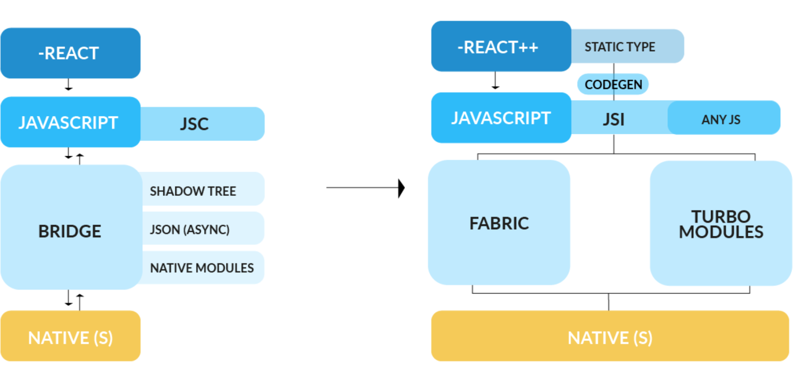
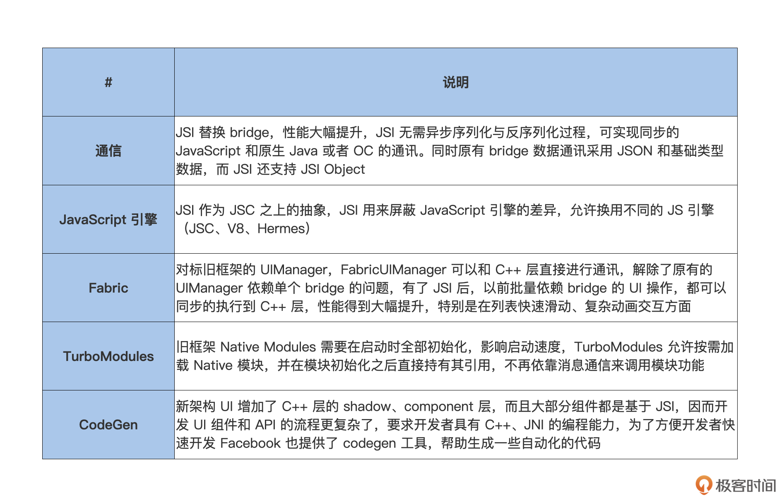
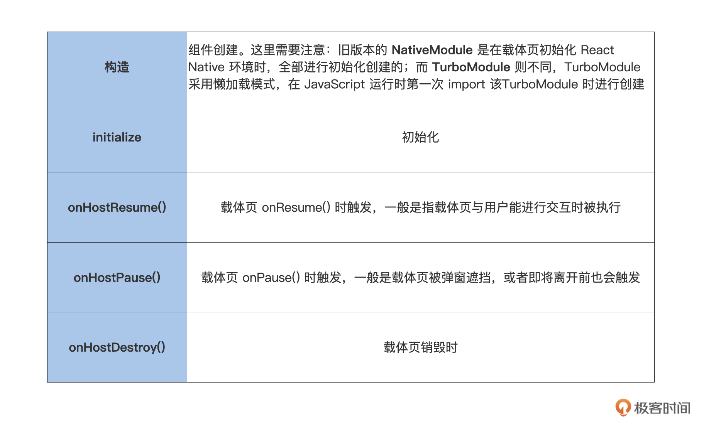
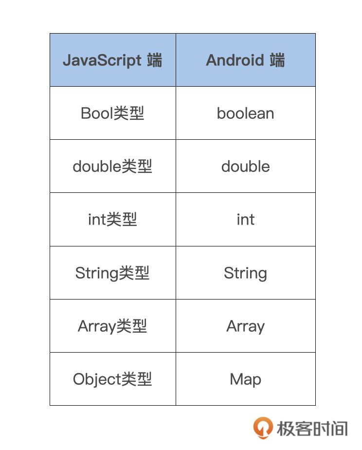
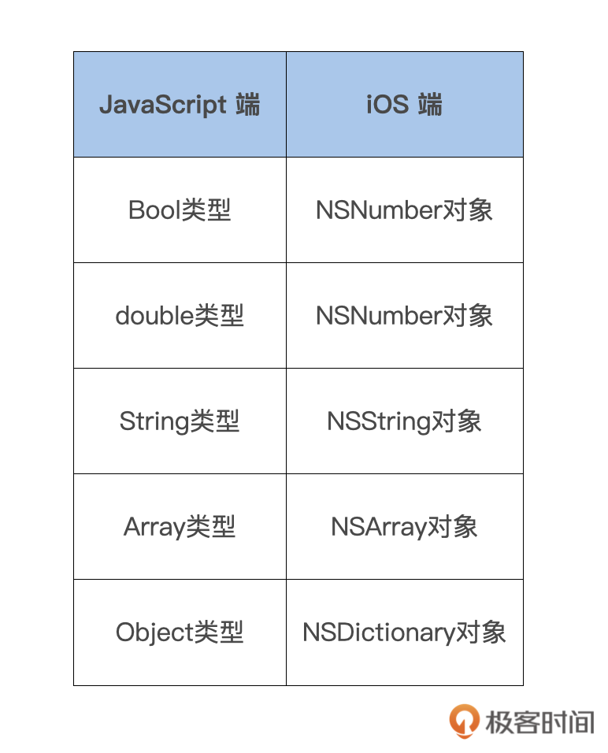

# 自定义组件

1. 实际开发中，除了负责 React Native 框架本身的维护迭代外，另一个重要的工作就是配合前端业务，开发对应的 Native 组件。

2. 什么时候用这些自定义的 Native 组件呢？

- 访问平台 API，但 React Native 可能还没有相应的模块包装；
- 复用公司内的一些用 Java/OC 写的通用组件，而不是用 JavaScript 重新实现一遍；
- 实现某些高性能的、多线程的代码，譬如图片处理、数据库，或者各种高级扩展等。

3. 在实际开发中，你可能还需要自定义组件的方方面面，包括新架构定义组件的全流程，以及实际业务中的踩坑指南等。

## 新架构

1. 新老架构：



2. 新架构变更点



### 组件生命周期

1. 组件的生命周期，指的是在组件创建、更新、销毁的过程中伴随的各种各样的函数执行。这些在组件特定的时期被触发的函数，统称为组件的生命周期。

让组件拥有生命周期，我们就可以更好地管理组件的状态、内存，跟随载体页的生命周期做相应的处理。

#### Android

1. 在 Android 端，一个 Module 组件的生命周期包括：

```md
构造 -> 初始化 -> onHostResume() -> onHostPause() -> onHostDestroy()
```

对应的意思：



2. 如何让 Native Module 具备生命周期呢？

React Native 给我们提供了一个接口：com.facebook.react.bridge.LifecycleEventListener。我们只需要在组件中添加这个接口的注册和取消注册，就可以让组件具备生命周期了。这里要注意，不要忘记在 onHostDestroy() 中移除注册，否则会造成内存泄漏。

```java

public class TestJavaModule extends ReactContextBaseJavaModule
 implements LifecycleEventListener, ReactModuleWithSpec, TurboModule {
    public TestJavaModule(ReactApplicationContext reactContext) {
       super(reactContext.real());
       reactContext.addLifecycleEventListener(this);
    }

    @Override
    public String getName() {
       return getClass().getSimpleName();
    }

    @Override
    public void onHostResume() {
    }

    @Override
    public void onHostPause() {
    }

    @Override
    public void onHostDestroy() {
       getReactApplicationContext().removeLifecycleEventListener(this);
    }
}
```

组件的生命周期原理很简单，**就是观察者模式。** 当载体页触发自身的生命周期回调时，调用 ReactInstanceManager 的 onHostXXX() 方法，ReactInstanceManager 进而调用 ReactContext 的对应回调。

### ios

1. iOS 中 NativeModules 组件的创建销毁时机，与 bridge 的创建销毁时机完全一致：

- alloc：创建当前组件；
- dealloc：销毁当前组件。

创建一个组件 TestNativeModule，通过 RCT_EXPORT_MODULE() 声明组件，默认会根据类名声明组件名，当然也可以通过在参数中传入其他字符串作为组件的名。

```object

@implementation TestNativeModule
RCT_EXPORT_MODULE()

- (instancetype)init{
  self = [super init];
  return self;
}
- (void)dealloc{
  NSLog(@"dealloc");
}
```

TurboModule 组件的生命周期却与 NativeModule 不同。TurboModule 采用懒加载模式，在 Bridge 创建后页面中第一次 import 当前 TurboModule ，也就是 JavaScript 端通过 TurboModuleRegistry.getEnforcing 方法加载组件时， Native 会创建对应的 TurboModule 并进行缓存。如果 JS 端没有加载当前自定义组件，该组件就不会进行初始化。

2. JS 端加载组件方式如下：

```ts

export default (TurboModuleRegistry.getEnforcing<Spec>(
   'TestTurboModule')
  : Spec);
```

3. TurboModule 的销毁时机与 Bridge 的销毁时机一致。 Bridge 进行销毁时会发送一个 RCTBridgeDidInvalidateModulesNotification 通知，TurboModuleManager 会监听该事件，依次对所有已创建的 TurboModule 进行销毁。

```
- (void)bridgeDidInvalidateModules:(NSNotification *)notification
{
  RCTBridge *bridge = notification.userInfo[@"bridge"];
  if (bridge != _bridge) {
    return;
  }
  [self _invalidateModules];//销毁所有TurboModules
}

```

在组件运行过程中，Native 与 JavaScript 不可避免地需要进行数据交互，如 JavaScript 调用组件方法传入数据，Native 向 JavaScript 回传结果，而 React Native 也帮我们封装好了对应的数据类型。

## 组件传输数据类型

1. 在 Native 与 JavaScript 通信的过程中，组件需要获取输入参数、回传结果，对此 React Native 给我们包装了相应的数据类型，方便快速操作

让 JavaScript 端调用 TestModule 的 testMethod 方法，传入参数 type 和 message，接收 native 回传数据：

```ts
NativeModules.TestModule.testMethod(
  { type: 1, message: 'fromJS' },
  (result) => {
    console.info(result);
  }
);
```

2. Android 端的组件传输数据类型：



tips: JavaScript 不支持 long 64 位长类型，只支持 int (32) 和 double，所以对于长数字，JavaScript 端统一用 double 表示。

实现上文中的 TestModule 了：

```java

public class TestModule extends ReactContextBaseJavaModule implements ReactModuleWithSpec, TurboModule {
   public TestModule(ReactApplicationContext reactContext) {
      super(reactContext.real());
   }

   @Override
   public String getName() {
      return getClass().getSimpleName();
   }

   @ReactMethod
   public void testMethod(ReadableMap data, Callback callback) {
      // 获取 JS 的调用输入参数
      int type = data.getInt("type");
      String message = data.getString("message");
      // 回传数据给 JS
      WritableMap resultMap = new WritableNativeMap();
      map.putInt("code", 1);
      map.putString("message", "success");
      callback.invoke(resultMap);
   }
}
```

定义了 Native 组件 TestModule，内部实现了 JavaScript 需要调用的 testMethod 方法。此方法包含两个参数：ReadableMap 和 Callback。ReadableMap 为 JavaScript 传入参数的字典，我们可以通过对应的 key 获取到 JavaScript 的入参值，而 Callback 是在 Native 回传数据时需要使用的.

### ios

1. iOS 端支持的传入数据类型：



2. iOS 端中是如何实现上文中的 TestModule 的呢？

在 Module 中进行 callback，然后通过 NSArray 来返回。

```
RCT_EXPORT_METHOD(getValueWithCallback : (RCTResponseSenderBlock)callback){
  if (!callback) {
    return;
  }
  callback(@[ @"value from callback!" ]);
}

```

## React Native 与原生的通信方式

1. 总体来说，native 向 JavaScript 传递数据的方式分成以下三种：

- Callback：由 JavaScript 主导触发，Native 进行回传，一次触发只能传递一次；
- Promise：由 JavaScript 主导触发，Native 进行回传，一次触发只能传递一次。Promise 是 ES6 的新特性，类似 RXJava 的链式调用。Promise 有三种状态，分别是 pending (进行时)、resolve (已完成)、reject (已失败)；
- 发送事件：由 Native 主导触发，可传递多次，类似 Android 的广播和 iOS 的通知中心。

### promise

1. JavaScript 端调用客户端定义的 SystemPropsModule 的 getSystemModel 来获取手机的设备类型，获取结果的方式使用 Promise 方式 （then… catch…）：

```ts
NativeModules.SystemPropsModule.getSystemModel()
  .then((result) => {
    console.log(result);
  })
  .catch((error) => {
    console.log(error);
  });
```

2. Native 端定义 SystemPropsModule，实现 getSystemModel 方法，内部使用 promise 获取手机的 model 数据。使用 promise.reolve(xx) 为成功，promise.reject(xx) 为失败：

```java

SystemPropsModule：
...
@ReactMethod
public void getSystemModel(Promise promise) {
    // 回传成功，使用 resolve
    promise.resolve(Build.MODEL);
}
...
```

### 发送事件

1. JavaScript 端使用 EventEmitterManager 来注册 Native 的事件监听。通过 NativeModules 获取 EventEmitterManager，随后使用它构建出 NativeEventEmitter，最后通过 NativeEventEmitter 注册监听：

```ts

componentWillMount(){
   // 拿到原生模块
   var eventEmitterManager = NativeModules.EventEmitterManager;
   const nativeEventEmitter = new NativeEventEmitter(eventEmitterManager);
   const eventEmitterManagerEvent = EventEmitterManager.EventEmitterManagerEvent;
   // 监听 Native 发送的通知
   this.listener = nativeEventEmitter.addListener(eventEmitterManagerEvent, (data) =>
       console.log("Receive native event: " + data);
   );
}

componentWillUnmount(){
   // 移除监听
   this.listener.remove();
}
```

2. 在 Native 端的使用则很简单。我们获取 RCTDeviceEventEmitter 这个 JSModule，使用 emit 方法就可以向 JavaScript 发送事件了：

```java
reactContext.getJSModule(DeviceEventManagerModule.RCTDeviceEventEmitter.class)
  .emit("msg", "say hello");
```

## TurboModule：数据存取

1. TurboModule 采用懒加载模式，在运行时第一次 import 该 TurboModule 时， Native 会创建对应的 TurboModule 并进行缓存。而旧版本的 NativeModule 都是在创建环境时统一进行构造的，会对 React Native 的启动性能有比较大的影响。

2. 使用 native 数据存取相关能力，如跨进程存取、偏好存取、加密存取等，而 React Native 自带的数据存储 module 满足不了你的需求，你可以通过自定义数据存储的 TurboMoudle 来实现。

### JavaScript

1. 在 Spec 中定义方法，定义好存和取的方法后，再导出 StorageModule：

```ts

export interface Spec extends TurboModule {
+save: (key: string, value: string, callback: (value: Object) => void) => void;
+get: (key: string, callback: (value: Object) => void) => void;
}
// 导出 StorageModule
export default (TurboModuleRegistry.getEnforcing<Spec>(
'StorageModule',
): Spec);
```

```ts
NativeModules.StorageModule.save('testKey', 'testValue', (result) => {
  console.info(result);
});
NativeModules.StorageModule.get('testKey', (result) => {
  console.info(result);
});
```

### Android

1. 第一步，我们要做些准备工作，也就是获取 newarchitecture 的模版代码。

2. 运行新架构

```properties

1. 修改 android 目录下的 gradle.properties:
# 开启新架构
newArchEnabled=true
# 配置 java home 为 JDK 11
org.gradle.java.home=/Library/Java/JavaVirtualMachines/jdk-11.0.2.jdk/Contents/Home

2. 运行
yarn react-native run-android
```

3. 第二步，拷贝 newarchitecture 的模版代码到我们之前的混合工程。

这一步中，我们需要将 Java 层和 C++ 层代码拷贝到混合工程中，需要拷贝的相关代码如下：

```
Java 层：
- MainComponentsRegistry.java
- MainApplicationTurboModuleManagerDelegate.java

C++ 层：
- jni 目录
```
