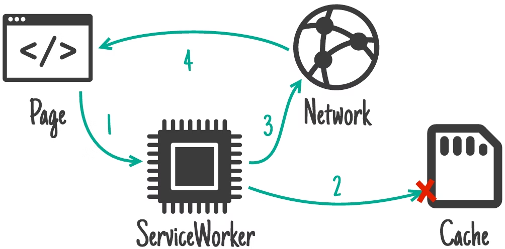
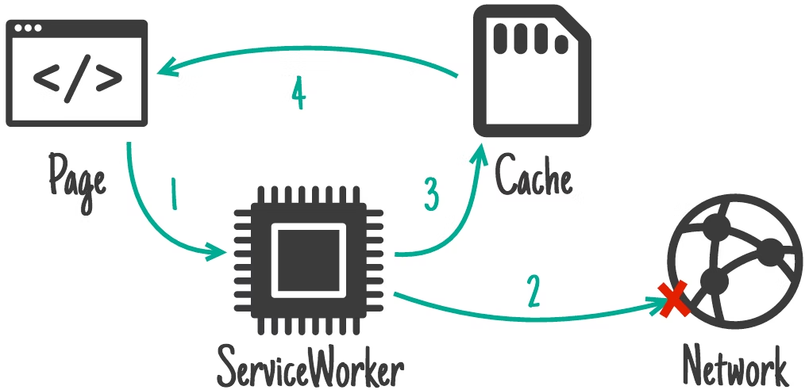
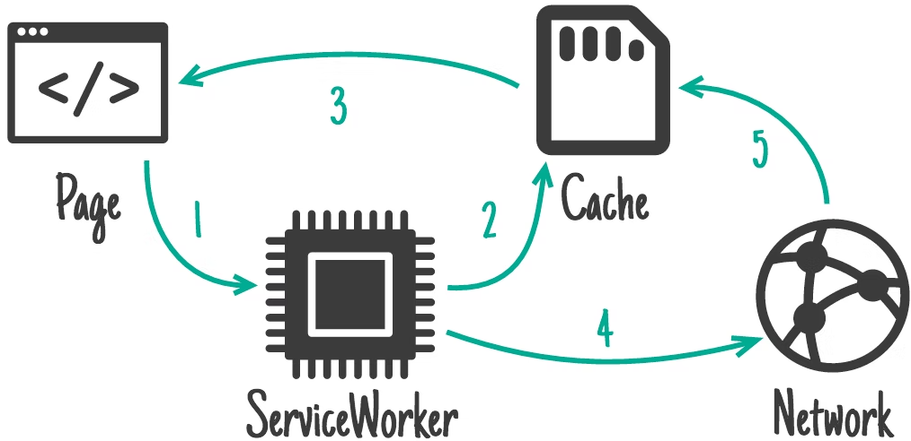

# 性能优化

1. 记住，比技术方案更重要的是技术思路。

如果你没有性能优化的思路，不能结合自己业务的实际情况分析，而是随便在网上找个方案，直接生搬硬套放在自己的 App 上，很容易吃力不讨好。

2. 性能优化方案：内置、Push、预加载、并行加载、热点资源定期拉取、按需加载等，这些方案都可以减少网络请求的耗时。

环境提前初始化、 Bundle 预执行、Hermes 字节码、inlineRequire 等方案，也可以减少执行耗时。

3. 这么多性能优化方案，我们都要上吗？应该根据什么标准来确定呢？先做哪个性能优化方案，后做哪个性能优化方案？你把性能优化上线后，又怎么和老板汇报自己的成绩呢？

## 以终为始的设计思路

1. 在一个公司中，性能优化是一个非常好出成绩的点，因为性能优化能够产出可量化的指标。

2. 把性能和业务指标挂钩后，这样汇报起来是不是更有说服力呢？

## 立项之前的指标统计

1. 以性能对页面到达率的影响为例，介绍一下统计方案：

- 版本请求；
- bundle 请求；
- native 初始化；
- js 初始化；
- 业务请求；
- 业务渲染。

2. 在开始性能优化项目立项之前，首先会统计当前业务的性能瓶颈和到达率。在本地确定各个关键时间点后，在这些关键点上埋上统计埋点。

以 React Native 混合应用为例，一个未优化的页面的主要加载流程包括：

- 版本请求、Bundle 请求、React Native 框架 Native 部分的初始化、React Native 框架 JavaScript 公共包的初始化、业务的数据请求，以及最终的业务渲染。

3. 版本请求存在两种情况，一种请求是用户请求成功，另一种情况是用户请求失败。请求失败的原因可能有很多，有些情况可能是，网络请求速度慢，用户不想等了，中途退出了；有些情况是，用户误点了，直接中途点击 back 按钮取消跳转了，销毁了载体页，不再发送统计埋点了；还有可能是超时、报错等失败情况。

4. 成功的情况下，版本请求开始埋点和版本请求结束埋点都发送成功，此时用户为“达到用户”；而在失败的情况下，版本请求开始埋点会发送成功，版本请求结束埋点会发送失败，此时用户为“未达到用户”。

## 优化方案的确定

1. 当项目准备立项之前，你还有一项最重要的事情要做，就是选择优化方案。

2. 优化方案很多该怎么选呢？

**简单来说，就是什么方案性价比最高，就优先选择什么方案。一般来说，能够直接复用业内开源工具的方案，实现成本更低，比如 Hermes 引擎、模块拆包、Dynamic Import、inlineRequire。这些方案基本上拿来直接适配一下就能用，你选一个预期成本低、收益高的方案做就行。**

而比如自研加载策略、预请求策略、代码预执行、HTTP 优化、SSR 这些方面，业内只提供了思路，没有开源方案，开发成本很高，你可以后面再做。

### 网络请求类优化

1. 网络请求类优化包括版本请求、 Bundle 请求、业务请求的优化，主流的方向如下：

- HTTP：编码效率优化、信道利用率优化、传输路径优化、信息安全优化；
- 加载策略：NetWork Only、Cache First、Network First、Stale While Revalidate（当次更新，下次生效）；
- 拆包策略：patch 拆包 / 模块拆包、内置包、增量更新；
- 预请求策略：首页预请求、上个页面预请求、热点资源定时更新、并行
- 版本请求和业务请求的策略；延后请求策略：Dynamic Import；
- 视觉策略：跳转动画、骨架屏。

### 执行耗时优化

1. 常用的执行耗时优化，包括 React Native 的 Native 代码初始化、JavaScript 代码初始化、业务渲染的优化方案如下：

- 引擎优化：JSC 引擎、Hermes 引擎、V8 引擎；
- 代码预执行：Native 环境预创建、JavaScript 公共代码预执行、React Native SSR；
- 代码懒执行：新架构、inlineRequire、Dynamic Import。

## 整体加载策略

1. 整体加载策略上，可以考虑是 [Service Worker](https://developer.chrome.com/docs/workbox/caching-strategies-overview/) 的加载策略

Service Worker 和 React Native 混合应用很相似。Service Worker 的本质是充当 Web 应用程序与服务端之间的代理服务，Service Worker 代理服务会拦截 Web 应用的请求，并决定请求返回值是来自本地，还是来自服务端。

而 React Native 混合应用也是类似的。Native 充当了 React Native 应用与服务端之间的代理服务，Native 代理服务帮助 React Native 应用进行版本请求、资源请求，并决定版本请求、资源请求的返回值是来自本地，还是来自服务端。

Native 在版本请求、资源请求上的作用，是不是和 Service Worker 非常类似？不同的是，Native 的版本请求、资源请求是定制的，而 Service Worker 的请求是可自定义的。

2. Service Worker 有哪些常用的策略可以参考呢？主要包括 4 种：

- NetWork Only；
- Cache First；
- Network First；
- Stale While Revalidate。

3. NetWork Only 加载策略。这个方案中，页面请求只是过了一下 Service Worker 代理，然后直接请求服务端。

4. Cache First 策略。页面请求到 Service Worker 代理，然后优先读取 Cache 值返回。如果 Cache 不存在，或则 Cache 读取失败，则接着请求网络，返回相应值：

5. Network First 加载策略。不同于 Cache First 和 Network First 加载策略，这个策略会优先从服务端请求返回值，只有服务端请求失败时才会从 Cache 中读取返回值

6. Stale While Revalidate 加载策略。这个策略会稍微复杂一点，在第一次请求时，没有 Cache，会先从服务端请求返回值，并将资源存放在 Cache 中。在第二次有 Cache 时，会先读取 Cache 并进行返回，在读取 Cache 的同时，会发起一个异步请求去更新 Cache。

7. Bundle 预加载方案。由于首页是 Native 页面，因此可以在首页加载完成的空闲时间，把 Tab 页面的 Bundle 资源给提前下载并缓存了。然后再把 Tab 页面的 Stale While Revalidate 策略开启，这样用户在进入 Tab 页面的时候就能够直接使用 Cache 的 Bundle 进行加载了。当然，并不是所有的 Bundle 资源都适合预加载，你需要在页面性能提升和用户流量浪费之间做取舍，每个页面请求都不一样，没办法统一处理，只能 Case By Case 地、一个个地配置预加载功能。

## 小结

1. 性能优化项目这类技术类项目有着明确的、可量化的技术指标和业务指标，因此在立项之初，我们就应该以用户为出发点，评估项目的成本和收益。有了明确的预期数据后，无论是在立项还是总结汇报时，都会有很大的优势。

2. 在项目设计环节，不要立刻着手开始开发，应该结合业务实际的性能瓶颈，调研业内的成熟方案，然后产出适合自己的技术方案进行落地。

3. 性能优化要做的事情很多，对于热更新 React Native 应用而言，最关键的优化环节是版本请求和 Bundle 请求。
