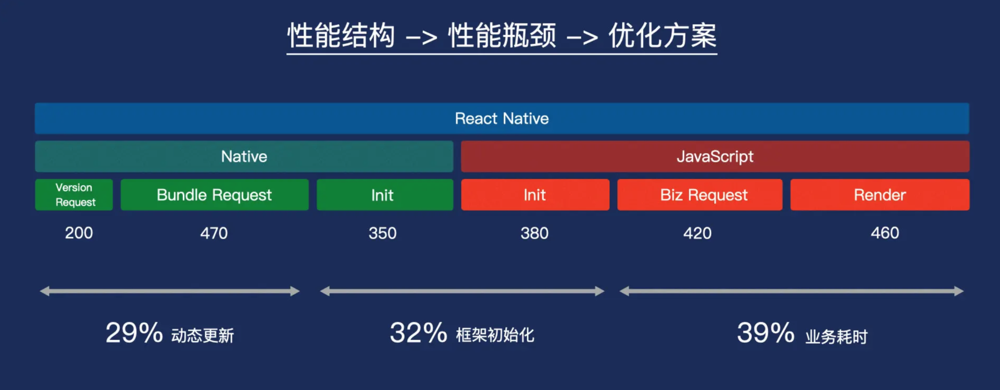
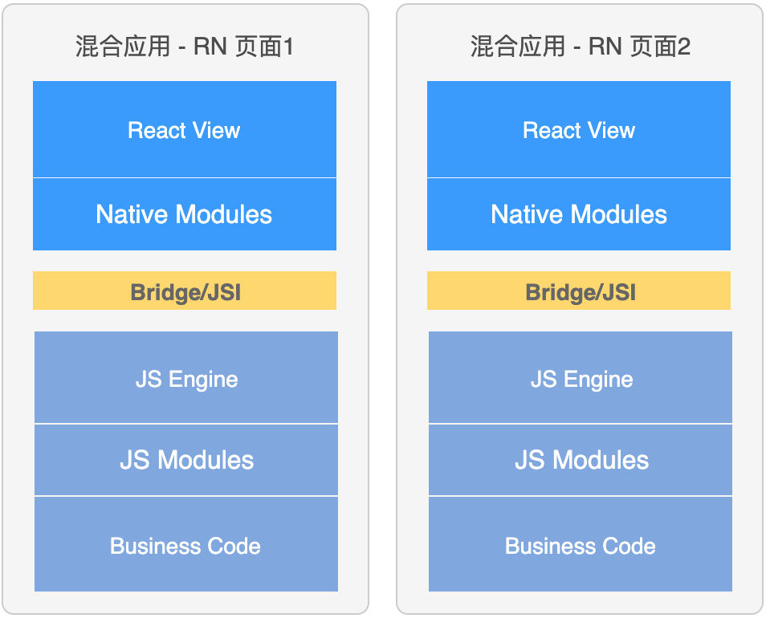

# 客户端优化

1. 和原生开发相比，React Native 比较明显的不足在于页面加载速度，比如秒开率、页面加载的时长等。

2. 一个未经优化的、比较复杂的、动态更新的 React Native 应用，从大体上讲，可以分为 3 个瓶颈（以下数据来自实际业务案例）：

- 动态更新瓶颈：29%；
- 初始化瓶颈：32%；
- 业务耗时瓶颈：39%

从客户端角度，React Native 如何在客户端侧将性能优化到极致，开启 React Native 的秒开世界。

## 环境预创建

1. 在 React Native 最新架构中，Turbo Module 是按需加载，而不是像旧框架一般，一股脑初始化所有的 Native Modules，同时 Hermes 引擎放弃了 JIT，在启动速度方面也有明显提升。

2. 抛开这两个新版本的优化，在启动速度方面，客户端还能做些什么呢？

React Native 环境预创建。

3. 在混合工程中，React Native 环境与加载页面的关系如下：

在混合应用中，独立的 React Native 载体页都拥有自己的执行环境。Native 域包括 React View、Native Modules；JavaScript 域包括 JavaScript 引擎、JS Modules、业务代码；中间通信使用 Bridge/JSI。

业内也有多个页面复用一个引擎的优化。但是多页面复用一个引擎存在一些问题，比如 JavaScript 上下文隔离、多页面渲染错乱、JavaScript 引擎不可逆异常，等等。而且复用的性能不稳定，考虑到投入产出比、维护成本等方面，通常在混合开发中，采用的是一个载体页一个引擎。

4.
