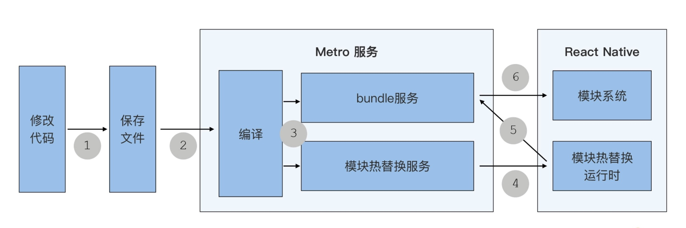
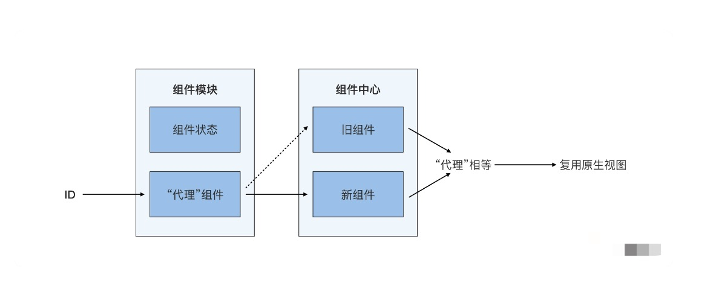
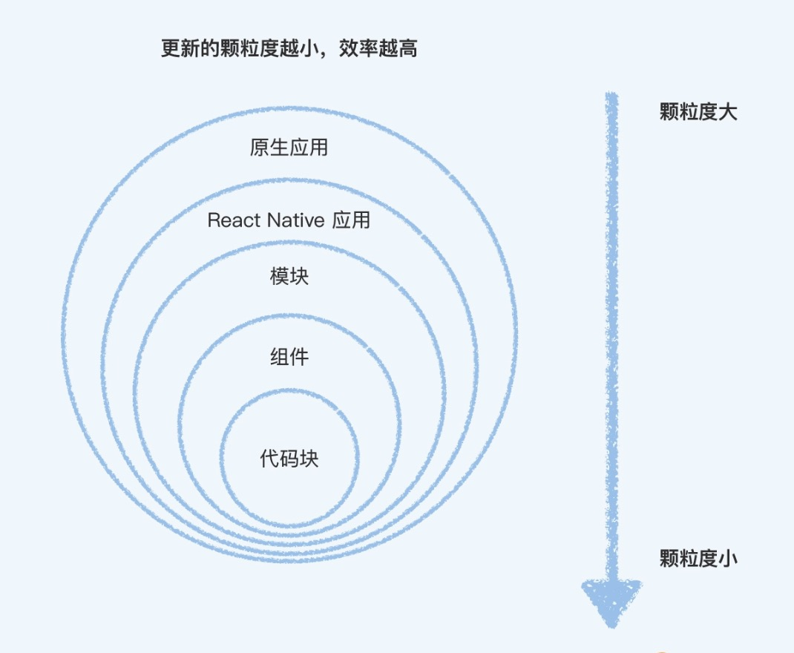

# Fast Refresh: 提高 UI 调试效率神器

1. 那 UI 调试效率重要吗？

非常重要。

## 使用快速刷新

1. React Native 快速刷新（Fast Refresh）是默认开启的，你不用做任何额外的配置，就能立刻体验到。

## 基础原理：模块热替换

1. React Native 的快速刷新功能的最早期版本，叫做热重载 Hot Reload，是基于 Webpack 的模块热替换（Hot Module Replacement）的原理开发的。我们写 React Native 之前，都会运行一个 react-native start 命令，启动一个 Metro 服务，而 Metro 服务就实现了模块热替换的功能。

2. Metro 的模块热替换服务和 React Native 应用中的模块热替换客户端（HMR Client），在启动时其实已经建立好了 socket 连接。

3. 模块替换示意图：

问题：

- 仅仅只是用新模块替换旧模块，会导致原生视图重新渲染，并且丢失原有状态；

### 复用组件及其状态

1. 快速刷新功能复用组件和状态的原理分为两个步骤：

- 在编译时，修改组件的注册方式；
- 在运行时，用“代理”的方式管理新旧组件的切换。

2. 代理组件是存在全局对象上的，所以当你保存代码引起模块系统更新时，代理组件的引用也不会发生改变。接着，页面开始更新，此时调用的是代理组件的 render 方法，然后代理组件调用的更新后的新模块组件的 render 方法。你每保存一次代码，模块系统都更新一次，代理组件实际 render 也会进行一次切换，但是只要你的代码没有变化，React 也不会重新创建原生视图。React Native 组件级别的快速刷新，就是通过代理组件实现的。

3. 状态复用

一个文件就是一个模块，如果里面只有一个函数组件的话，我们就可以把它叫做一个函数组件模块。模块代码是执行在该模块的上下文中的，上下文中有着各种变量，其中就包括状态。通过“代理”组件的方式，就可以实现在同一个组件模块的上下文中，执行不同的函数组件。无论是新函数组件，还是旧函数组件，用的都是相同的状态，这就是状态复用。

4. 组件所代表的原始视图的复用又指的是什么呢？

render 时判断是否要重新创建原生视图，是通过浅对比算法 shallowCompare 实现的。如果新旧组件的类型相等就走 re-update 的逻辑不创建，如果新旧组件的类型不相等就走 re-mount 的逻辑重新创建。现在，新旧组件的“代理”是就是同一个对象，状态也不会发生改变，浅对比算法判断肯定相等，所以原生视图不会重新创建，从而实现了原生视图的复用。

**React Native 的快速刷新功能，就是通过“代理”组件的方式，实现了组件状态不丢失，原生视图不重建。**

5. 快速刷新 babel 编译后的复用模型:

6. 并不是所有情况都会复用状态和原生视图。

对于函数组件来说，hooks 的顺序非常重要，相同的状态下，不同的顺序会有不同的结果。如果你修改了 hooks 的顺序，快速刷新时就会重新初始化状态。在其他情况下，函数组件的快速刷新都会为你保留状态。

对于类组件来说，只要是类组件的代码发生更新，组件的内部状态都要重新初始化。关于这点，快速刷新功能的作者 Dan 在博客中解释到，“（保留类组件的状态）热重载是非常不可靠的，最大原因就是类组件的方法是可以被动态替换的。是的，在实例原型链上替换它们很简单，但是根据我的经验，有太多边缘情况了，它根本没有办法可靠地工作”。

7. 建议是，尽可能地拥抱函数组件，放弃类组件。这样你在 UI 调试的时候，就能更多的享受函数组件带来的状态保留好处。

8. 如果项目中已经用到了很多类组件，又要调试一些入口很深的组件，怎么办？方法也很简单，你应该把你要调试的组件，单独拎出来调试。如果拎出来的组件和其他组件有依赖关系，也可以通过 mock 数据的形式对其依赖进行解耦，实现快速调试。

## 整体策略：逐步降级

1. 快速刷新的整体策略就是逐步降级。如果颗粒度最小的更新不能使用，就换成颗粒度大一些的更新：

- 代码块：如果你只修改了函数组件中的一些代码块，并且没有改动 hooks 的顺序。快速刷新在复用状态和原生视图的同时，你对该文件的所有修改都会生效，包括样式、渲染逻辑、事件处理、甚至一些副作用；
- 组件：如果你修改了类组件中的任意代码，快速刷新会使用新的类组件进行重新渲染，原来的状态和原生视图都会被销毁；
- 模块：如果你修改的模块导出的东西不只是 React 组件，快速刷新将重新执行该模块以及所有依赖它的模块；
- React Native 应用：如果你修改的文件被 React 组件树之外的模块引用了，快速刷新将重新渲染整个 React Native 应用。

2. 快速刷新的逐步降级策略是，从更新颗粒度最小代码块开始的，然后是组件、模块，最后是大颗粒度的 React Native 应用。越小颗粒度的更新，为我们保留了越多原来的状态和环境，我们的开发调试效率也更高。

示意图：

## 要点

1. 调试 UI 最重要的是即使反馈和所码即所见。React Native 的快速刷新能力，会把我们的代码修改，尽可能快地展示出来。

2. 用好快速刷新功能的三个小技巧：

- 同屏预览。将模拟器置顶在编辑器上方，减少你视野来回切换频率；
- 拥抱函数组件。函数组件能保留原有组件状态，减少你操作交互的次数；单独拎出来调试。
- 单独拎出来先开发独立组件再集成，可能会比在层层嵌套的代码结构中开发效率更高。
