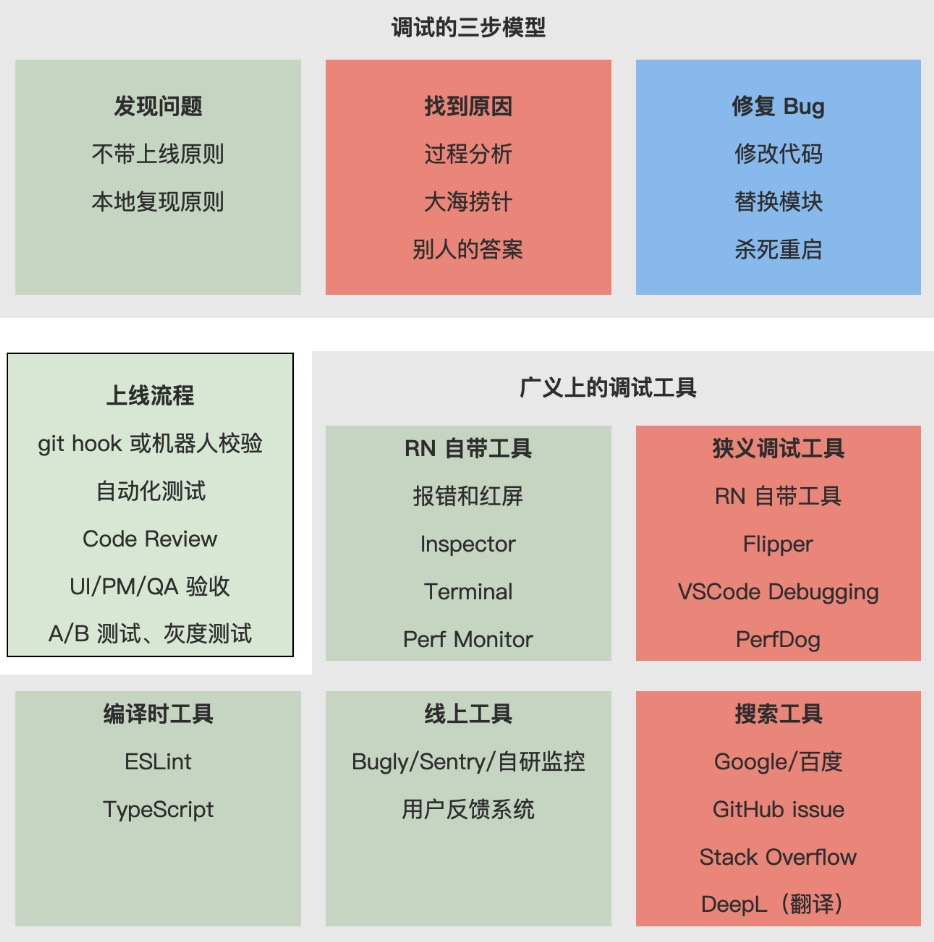
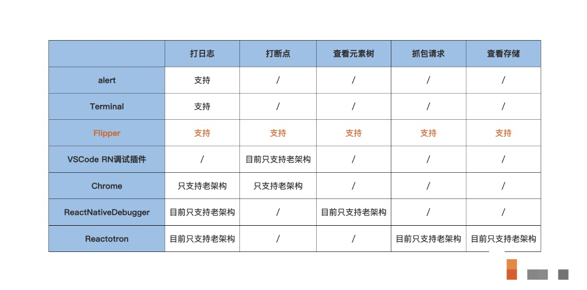

# 解决 Bug 的思路

1. 解决 bug 的通用思路：一个模型，二个原则，三条思路

## 一个模型：发现问题、找到原因、修复 Bug

1. 注意，狭义和广义调试是有所不同的。狭义的调试，指的是代码运行时打日志、打断点；但广义的调试，指的是发现问题和解决问题的过程（Debugging is the process of finding and resolving bug）。

2. 调试示意图：

### 两个原则：不带上线原则和本地复现原则

1. 不带上线原则：要尽可能早地在本地开发时发现问题，提前发现问题是不带 Bug 上线的必要条件；

2. 本地复现原则：如果 Bug 已经被带上线了，我们要尽快发现它，还要尽可能多地收集线上信息，让它能更容易地在自己的手机或本地复现。

3. 不带上线原则怎么实践呢？

- 首先，我们要清楚，没有任何的线上 Bug 是不可能的，但我们可以减少带上线的风险，比如团队成员之间可以通过合作建立一套完善的上线流程，依靠流程和机制来减少风险;
- 其次，在这套流程和机制下，我们自己可以选择合适的工具来减少风险。

4. 一个理想的上线流程和配套工具是什么样的呢？

**Tips: GitHub 社区其实已经为我们提供了一种答案。**

GitHub 社区中那些流行的仓库都有一套完整的上线流程，比如 React、React Native 仓库，一般都有自动化的本地校验和线上校验，还有项目成员的 Code Review。这套流程经历了上千人的校验，我认为是非常有学习和实践价值的。

5. 理想上线流程的另一套答案:

当我们把新功能推到的代码仓库的主分支中，我们还需要把主分支中的代码进行上线。在上线过程中，我们需要靠 UI 验收、靠 QA 测试、靠 PM 体验，靠团队的力量来尽早发现 Bug。必要的时候，还可以在上线平台上下功夫，比如只有 QA 拥有上线权限，又比如做 A/B 测试、灰度测试等。

6. 大部分时候，那些线上的、偶现的、没有报错信息的 Bug，比本地的、必现的、有报错信息的 Bug，更加缺乏有效信息，也更难发现。**对于线上 Bug 而言，快速发现线上 Bug 关键是对线上数据的收集，并通过收集的数据来进行分析，使其能在本地复现。**

7. 两种工具： **监控系统，用户反馈系统。**

在技术层面接入一套监控系统，比如腾讯出品的常用于原生应用监控的 Bugly，或者开源领域的 Sentry，又或者是自研的监控平台，这些都是可以的。在产品层面上，我们需要有一套用户反馈机制，它们的核心作用是发现那些本地难以复现、又缺乏线上报错数据的 Bug。

实际上，每个团队、每个项目的情况都不一样，你可以根据自己项目的情况进行选择。

### 三条思路：一推理、二分法、三问人

发现问题之后，接着就要寻找问题的原因。寻找问题的原因有哪些思路呢

1. 一推理

所谓的“一推理”，它指的是，我们遇到问题首先要做的是冷静地思考、分析和推理，要搞清楚问题是什么，知道问题是什么了，能直接解决的就自己直接解决，不要一开始就去网上搜答案。网上答案很多，但搜索正确答案成本很高，而且别人的答案不一定能解决你的问题。

你不妨先从红屏报错中提炼有用信息，再检查代码逻辑是否有明显错误并得出初步判断，然后打日志、打断点，再重新跑一次代码，验证你的判断。如果遇到的是复杂代码，可以从代码模块的出口入口着手来判断，然后再分析代码内部细节。在分析阶段中，我们也离不开（狭义）调试工具的支持。

2. 红屏信息

对于那些本地的、必现的、有红屏报错的 Bug 而言，红屏信息有时候能帮你直接指出是你的代码哪里有问题。即便是那些没有提供具体报错代码的红屏报错，也会提供一些有用信息，只是这些有用信息需要你想一下才能分析出来。

有些人在遇到红屏报错时，只是稍微看了一眼红屏信息，并不会去仔细地研究红屏信息内容，就直接动手开始改起代码了。这就相当于，有一份地图你不用，就直接闯起了迷宫。

**当你遇到红屏时，应该先认真读一遍红屏中的报错信息，第一遍没读懂没关系再多读几遍，英文不熟也不要紧，可以翻译一下，**看看有什么关键字，再仔细想一下。很多时候，当你真的这么做了就找到原因了，不用后面那些分析步骤了。

- 检查逻辑：

有时候呢，我们可以根据红屏提供的执行结果，猜出大致的问题范围。这时候呢，你可以先在脑袋里面过一遍代码执行过程，先检查一下自己是不是有拼写错误、API 的使用方法对不对、一些边际条件有没有考虑到等等。检查一遍之后，即便没有找到原因，心里多多少少会有一些判断。

- 执行代码：

在你有这些判断后，你就可以通过打日志、打断点等方式来验证你的判断，找到到底是哪个变量或者是哪段逻辑有问题了。

这里需要和你强调的是，不要一上来毫无头绪就开始打日志、打断点，这样做效率很低。**一定要先检查代码、先判断原因，再去打日志、打断点去验证你的判断，这样你的调试能力、逻辑能力才会慢慢变强，调试速度才能慢慢提高。**

- 出口入口：

有时候代码太复杂了，代码内部执行的步骤太多了，要寻找是具体是哪段逻辑有问题就太难了。这时候，你可以先对代码的入口或出口的数据进行分析。比如，函数组件可能有问题，你可以通过工具查看元素树的结构和具体元素属性；又比如，前后端交互的请求可能有问题，你可以抓包看请求内容；再比如，本地磁盘存储结果有问题，你可以去查看存储结果。

从出口和入口开始分析先得出结论，再打日志、打断点定位问题原因，有时候可能比直接分析复杂代码的内部逻辑得出结论，要更快一些。

- 分析工具：

在分析阶段，必不可少的就是（狭义）调试工具，像打日志、打断点、抓包请求、查看存储这些功能都需要调试工具的支持。

一些常用的工具：

- 弹窗 alert，它的好处是依赖任何环境，但一个弹窗能展示的内容太少了，只有在线上环境我才会用到它。

2. 调试工具

- Facebook 出品的移动应用调试工具 Flipper 就不错，需要单独进行下载。
- 比较流行的调试工具还有 React Native Debugger、Reactotron，如果涉及原生代码，你还可用 Android Studio、Xcode 进行调试。

这些工具你不必每个都要学会怎么使用，选择几个你顺手的即可。工具只是辅助，关键是分析本身，调试工具只要够用就行。推荐使用 Terminal 和 Flipper。

#### 二分法

1. 所谓的“二分法”，说的是在我们不能确定问题原因的时候，把所有潜在的问题都用类似“数组二分查找”的方式把代码遍历一遍，不断缩小问题的范围，最终找到问题原因。

2. “二分法”怎么分呢？

一个排除疑难杂症的通用思路是这样的，我们的代码是运行在环境中的，代码本身也有多个版本的、同一个版本中代码也是分多个模块的。那我们就可以从环境、版本、模块入手排查。

- 先把环境和代码分开，先排查环境原因，如果别人的电脑、手机都没有问题，我的有问题，那就可以判断是我的电脑、手机的环境有问题，否则就是代码问题;
- 如果是代码问题，我们再排查上一个上线版本有没有问题，上一次 commit 的代码有没有问题，如果上一次也有问题就是历史遗留问题，否则就是新引入的问题;
- 如果是新引入的问题，再从根组件开始排查，一个 React Native 应用（或页面）只有一个 Root 组件，一个 Root 组件有若干个子组件，子组件又有自己的子子组件，这就组成了一个组件树，你只要顺着 Root 组件一步一步地进行二分判断，看哪一边的子树是有问题的，哪一边的子树是没有问题的，最终就能确定问题代码的范围了。

3. “二分法”的思路是从整体到局部，它还有一个变种就是“多分法”。比如首屏性能问题，用户从点击、到请求、再到渲染的过程是一个整体，你可以把这个整体中各个阶段中的关键节点都埋上性能统计埋点，找到那些优化收益率高的、做起来容易的地方去优化。只有从整体的视角出发，分析出每个局部的优化空间有多少，你才能判断各个技术方案的投入产出比（ROI），做出全局最优的决定。

### 三问人

1. 所谓的“三问人”，说的是我们借鉴别人的经验来解决自己的问题，别人可以是同事、朋友、微信群，也可以是搜索引擎。

2. 搜索引擎的使用技巧和经验：

- Google 搜到的资料更全一些有博客、论坛、GitHub、学习型网站；
- 百度搜到的大多是国内开发者的博客；
- 专业的技术网站，比如 GitHub 和 Stack Overflow，这类专业技术提供的搜索引擎的搜索效率，有时候比 Google 还要更高一些。有时候我在 Google 搜索出的内容不是我想要的；
- GitHub 的 React Native 仓库的 Issues 中和 Stack Overflow 上直接搜索，它们推荐的内容就会更加精准一些。

## 要点

1. 自带工具：

- react-native doctor：可以帮忙检查本地环境是否搭建是否有问题。
- Perf Monitor：调试情况下摇一摇手机，就会有一个弹窗，其中 Perf Monitor 功能可以帮你查看本地的 JavaScript FPS 和 Native FPS。
- Inspect：摇一摇中的 Inspect 功能，可以帮我们查看组件树的结构。

2. 搜索工具：

- 翻译：DeepL、谷歌翻译 百度翻译。DeepL 还有客户端，配合快捷键使用更方便。
- 搜索：谷歌搜索、百度搜索
- 专业网站：React Native GitHub Issues、Stack Overflow

3. 第三方工具：

- (推荐）Facebook 推出的移动应用调试工具 Flipper；
- （不推荐）微软推出的 VSCode 插件 React Native Tools；
- （不推荐）Infinitered 推出的 Reactotron；
- （不推荐）React Native Debugger。
